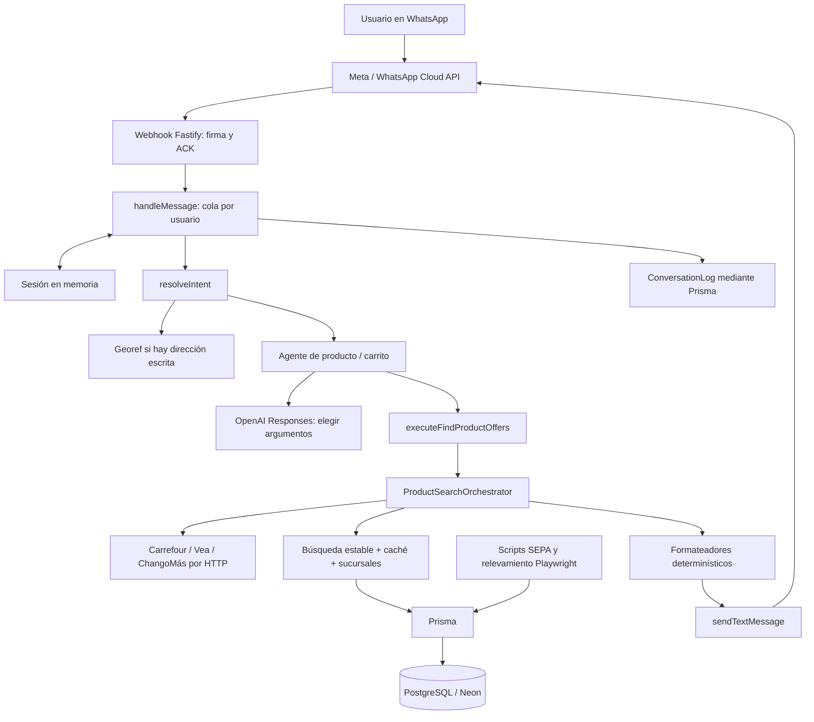
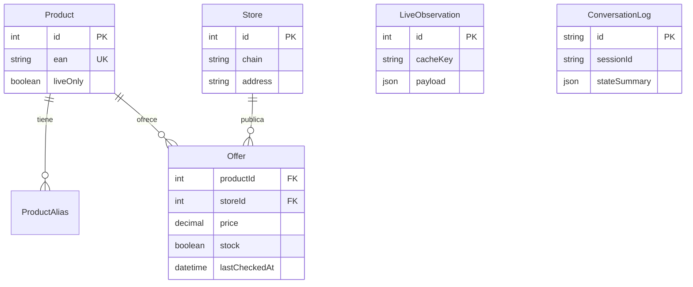

# Guía para presentar técnicamente el proyecto IACKATÓN

Revisión del repositorio: **17 de septiembre de 2026**. Esta guía describe el código presente, no una arquitectura ideal ni el estado de servicios externos. Se revisaron los módulos de `src/`, scripts, esquema y migraciones, pruebas, configuraciones y documentación de apoyo; esta actualización incorpora los últimos ajustes de producto, carrito y contexto. No se leyeron credenciales ni se consultó la base de producción para escribirla.

**Cómo leer los estados:**

- **IMPLEMENTADO:** existe un recorrido ejecutable en el código. No implica que un proveedor externo esté disponible en este momento.
- **PARCIAL:** existe una capacidad con restricciones concretas que se explican.
- **FUTURO:** propuesta; no debe presentarse como funcionalidad actual.
- **No confirmado en el repositorio:** no puede deducirse del código, por ejemplo saldo, token vigente, número real habilitado o despliegue actualmente activo.

La última validación del código, ejecutada antes de esta actualización documental, dio **262 tests aprobados, 0 fallidos, 0 omitidos; typecheck y build aprobados**. Esta edición solo modifica la guía y no repite esa ejecución. No se hicieron compras, importaciones, inferencias pagas ni envíos de WhatsApp. Los precios, cantidades de ofertas en Neon y resultados de documentos históricos no se presentan como datos actuales.

## Índice para estudiar

1. [Problema y experiencia del usuario](#1-problema-y-experiencia-del-usuario)
2. [Arquitectura general](#2-arquitectura-general)
3. [Tecnologías y su función concreta](#3-tecnologías-y-su-función-concreta)
4. [Mapa de archivos](#4-mapa-de-archivos)
5. [Recorrido de un mensaje](#5-recorrido-de-un-mensaje)
6. [IA y function calling](#6-ia-y-function-calling)
7. [Búsqueda y fuentes comerciales](#7-búsqueda-y-fuentes-comerciales)
8. [Ubicación](#8-ubicación)
9. [Carrito](#9-carrito)
10. [Contexto e intenciones](#10-contexto-e-intenciones)
11. [Base de datos](#11-base-de-datos)
12. [Logging y diagnóstico](#12-logging-y-diagnóstico)
13. [Deploy y configuración](#13-deploy-y-configuración)
14. [Tests y significado de la validación](#14-tests-y-significado-de-la-validación)
15. [Seguridad y decisiones de diseño](#15-seguridad-y-decisiones-de-diseño)
16. [Limitaciones verificables](#16-limitaciones-verificables)
17. [Qué podría escalarse](#17-qué-podría-escalarse)
18. [Preguntas de los jueces](#18-preguntas-de-los-jueces)
19. [Guiones orales](#19-guiones-orales)
20. [Glosario](#20-glosario)

## 1. Problema y experiencia del usuario

**IMPLEMENTADO.** El proyecto ayuda a comparar productos de supermercado por precio y proximidad usando WhatsApp. El usuario expresa qué busca en lenguaje cotidiano y comparte una ubicación. El backend busca ofertas y devuelve una comparación, explicitando cuándo el precio es online o la disponibilidad local no está confirmada.

La dificultad no es solamente obtener un importe. Hay que comprobar que se compare el mismo producto, tamaño y variante, asociar la información con una sucursal cuando sea posible, calcular distancia y conservar el contexto entre mensajes.

El usuario puede buscar un producto, pedir el menor precio o la opción más cercana, consultar una lista, cambiar cantidades, mostrar su carrito, cambiar ubicación mediante GPS o dirección escrita y pedir detalles como fuente o fecha. No hay compra, cobro, reserva ni creación de una orden real.

### Ejemplo completo, sin inventar resultados comerciales

| Turno | Qué ocurre realmente |
|---|---|
| Usuario: «Buscame Coca Zero y quiero la más barata» | El router reconoce búsqueda y criterio de precio. Guarda la búsqueda. |
| Bot: «Compartime tu ubicación para buscar los comercios más cercanos.» | Si no existe ubicación, la solicita sin inferencia de OpenAI. |
| Usuario comparte GPS | Se valida y guarda; se reanuda la búsqueda pendiente. |
| Bot devuelve hasta tres ofertas | Los importes y sucursales salen de los resultados consultados. La respuesta compacta muestra precio, distancia y una nota de disponibilidad. Si no hay coincidencia/ofertas, lo informa. |
| Usuario: «¿Y la más cercana?» | Conserva la variante del resultado principal mediante `lastProduct.selectedQuery` y cambia el criterio. No vuelve a pedir GPS. |
| Usuario envía una lista de Oreo, Coca Zero y Playadito | Guarda un carrito y compara las tres cadenas configuradas. |
| Usuario: «Cambia las oreo de 1 a 2 unidades» | Modifica solo ese ítem, invalida resultados y responde «🛒 Tu carrito actual:». No busca precios todavía. |
| Usuario: «Más barata?» | Compara el carrito actualizado; al haberse invalidado `cartResults`, consulta sus productos. |
| Usuario: «De esos supermercados cuál me queda más cerca?» | Reutiliza `cartResults`; no vuelve a relevar precios solo para reordenarlos. |
| Usuario: «Quiero cambiar mi ubicación» y luego una dirección | Mantiene carrito, producto y ubicación anterior hasta confirmar la nueva. |

Otro caso implementado: si pide «Coca Zero 2L» y solo se encuentra una alternativa real de 1,5 L, el bot distingue ambas presentaciones y ofrece la alternativa. Un «sí» acepta la única alternativa guardada sin pedir de nuevo el producto. Si ofreció varias, pide elegir; no decide una arbitrariamente.

Si querés mostrar un ejemplo con precios durante la exposición, usá una respuesta obtenida y fechada en la demo. Este documento no fija un precio que podría haber cambiado.

## 2. Arquitectura general

**IMPLEMENTADO: un backend Node.js organizado por módulos.** No son microservicios separados. Fastify, router, agente, búsqueda y formateadores viven en el mismo proceso; Meta, OpenAI, Georef, retailers y PostgreSQL son dependencias externas.



El recorrido «usuario → WhatsApp → Meta → webhook → router → sesión → búsqueda → fuentes → Prisma/Neon → respuesta» es una buena explicación inicial, con dos precisiones:

1. **SEPA se importa previamente.** Cada mensaje consulta las ofertas ya almacenadas; no descarga un ZIP de SEPA por conversación.
2. **Prisma interviene en varias ramas.** Lee ofertas y sucursales, guarda observaciones live y registra conversaciones. No todas las respuestas necesitan una consulta comercial: saludar o mostrar el carrito puede resolverse desde el estado, aunque el historial se intente persistir.

| Parte | Responsabilidad | Lo que no le corresponde |
|---|---|---|
| Meta Cloud API | Entregar eventos al webhook y recibir solicitudes de envío | Buscar precios de este proyecto |
| Fastify/webhook | Recibir HTTP, verificar autenticidad y programar procesamiento | Decidir el supermercado ganador |
| Router | Resolver intención según texto y contexto | Consultar precios por sí mismo |
| Sesión | Conservar estado por usuario durante la conversación | Ser un historial persistente o una memoria del modelo |
| Agente | Interpretar una nueva búsqueda mediante una herramienta permitida | Inventar hechos comerciales |
| Orquestador | Combinar datos estables, caché y consultas live | Garantizar cobertura de cualquier producto |
| Providers | Traducir cada fuente a datos internos verificables | Convertir precio online en stock físico |
| Prisma/PostgreSQL | Leer y escribir datos estructurados | Interpretar el lenguaje del usuario |
| Formateadores | Convertir resultados en mensajes breves o detallados | Completar datos ausentes con suposiciones |

## 3. Tecnologías y su función concreta

Las versiones siguientes son las **declaradas** en `package.json` o fijadas en `.nvmrc`, no una afirmación sobre la versión de un deploy remoto.

| Tecnología | Qué es | Uso en este proyecto y por qué encaja | Archivo/configuración |
|---|---|---|---|
| Node.js, fijado en 24.20.0 | Entorno que ejecuta JavaScript fuera del navegador | Ejecuta servidor, scripts y tests; permite esperar HTTP/DB sin bloquear todo el proceso | `.nvmrc`, `src/server.ts`, `package.json` |
| TypeScript, `^7.0.2` | JavaScript con comprobación estática de tipos | Define contratos de mensajes, resultados, estado y providers; detecta incompatibilidades antes del deploy | `tsconfig.json`, `tsconfig.build.json`, archivos `.ts` |
| ECMAScript Modules | Sistema de `import`/`export` | El paquete usa `type: module`; imports `.js` compatibles con la salida compilada | `package.json`, configuración `nodenext` |
| Fastify, `^5.12.1` | Framework de servidor HTTP | Organiza rutas, respuestas, parser del webhook y logs; `inject` permite probar rutas sin abrir un puerto | `src/server.ts`, `src/routes/`, `src/whatsapp/webhook.ts` |
| Pino, integrado mediante Fastify | Logger estructurado | Logs de requests y errores como objetos JSON; serializador `err` conserva información depurada | `src/server.ts`, `src/lib/safe-logging.ts` |
| Prisma / Prisma Client, `^6.19.0` | ORM y herramientas de esquema/migraciones | Acceso tipado a productos, ofertas, logs y caché; transacciones y upsert evitan cargas inconsistentes | `prisma/schema.prisma`, `src/lib/prisma.ts`, migraciones |
| PostgreSQL | Base relacional | Relaciones producto–sucursal–oferta, importes `Decimal`, índices y campos JSON | `prisma/schema.prisma`, SQL de migraciones |
| Neon | Servicio usado para alojar PostgreSQL en la documentación del proyecto | La aplicación se conecta con URLs PostgreSQL; no requiere un SDK de Neon | `docs/RAILWAY-DEPLOY.md`, `src/live/repository.ts`, datasource Prisma. Instancia activa: **No confirmado en el repositorio** |
| OpenAI SDK, `^7.9.0` | Cliente HTTP para OpenAI | Llama `client.responses.create` para interpretar producto y argumentos de búsqueda | `src/config/openai.ts`, `src/ai/agent.ts` |
| Responses API y function calling | API del modelo con herramientas declaradas | El modelo propone `findProductOffers`; el backend valida y ejecuta. Reduce el espacio de salida a una acción concreta | `src/ai/tools.ts`, `src/ai/agent.ts` |
| WhatsApp Cloud API / Meta Graph API | Canal de mensajería mediante HTTP | Entrada por webhook firmado y salida por `/messages`; el usuario no necesita instalar una interfaz propia | `src/whatsapp/webhook.ts`, `client.ts`, `config.ts` |
| `fetch`, `AbortSignal`, `Promise.allSettled` | APIs de HTTP y concurrencia | Consultas live con límites; una cadena fallida no invalida automáticamente las demás | `src/live/providers.ts`, `orchestrator.ts`, `geocoding.ts` |
| Playwright, `1.63.0-alpha-2026-08-31` | Automatización de navegadores | Relevamiento por scripts: usa el buscador real y observa JSON/JSON-LD. **No abre un navegador en cada consulta WhatsApp** | `src/prices/providers/playwright.provider.ts` |
| Playwright CLI, `^0.1.19` | Herramienta de exploración de páginas | Apoya investigación de buscadores/selectores/requests; no es el runner de los tests habituales | `package.json`, `docs/PLAYWRIGHT-AI.md`, `.claude/skills/playwright-cli/` |
| SEPA | Fuente de archivos con precios y sucursales | Importa observaciones con fecha declarada y EAN; aporta una base consultable sin depender de cada ecommerce en ese instante | `src/prices/providers/sepa.provider.ts`, `src/prices/config.ts` |
| Georef Argentina | Servicio de normalización/georreferenciación | Convierte una dirección escrita en coordenadas cuando existe un resultado aceptable | `src/whatsapp/geocoding.ts` |
| Railway / Railpack | Hosting y construcción del servicio | Configuración de build, migraciones, comando de arranque y healthcheck | `railway.toml`, `docs/RAILWAY-DEPLOY.md` |
| `dotenv`, `^17.4.2` | Carga variables desde un archivo local | Separa credenciales/configuración del código; Railway puede proveerlas sin archivo `.env` | `src/server.ts`, `src/lib/prisma.ts`, scripts |
| `tsx`, `^4.23.13` | Ejecutor de TypeScript | Desarrollo con watch y ejecución de scripts/tests sin compilar manualmente cada vez | `package.json` |
| `node:test` y `node:assert/strict` | Runner y aserciones integrados en Node | Pruebas unitarias, rutas en memoria, escenarios conversacionales y regresiones | `tests/`, script `test` |
| `node:crypto` | Primitivas criptográficas | HMAC de webhook, comparación de firmas, UUID de sesión y hash de clave de caché | `webhook.ts`, `session.ts`, `live/repository.ts` |
| Streams, `node:zlib` y parser CSV propio | Lectura incremental y descompresión | Procesa ZIP/CSV de SEPA evitando cargar todo el catálogo de productos en memoria | `src/prices/zip.ts`, `csv.ts` |
| ngrok | Túnel de desarrollo, documentado como comando externo | Expone el webhook local para una demo desde la PC. No es una dependencia npm ni requisito del deploy Railway | `docs/START-DEMO.md` |

No hay LangChain, LangGraph, embeddings, base vectorial, Redis, frontend propio ni Docker en el recorrido de aplicación revisado. JSON-LD y las estructuras VTEX se usan como **formatos de las fuentes comerciales**, no como frameworks agregados al backend.

## 4. Mapa de archivos

Todas las rutas de las tablas son relativas a la raíz del repositorio. Se inventariaron **53 archivos de aplicación, 5 scripts, 11 archivos de Prisma y 22 archivos de tests/fixtures**, además de configuración y documentación. Los artefactos de evidencia se agrupan por carpeta porque son capturas/reportes históricos, no módulos ejecutados por el bot.

### 4.1 Entrada HTTP, configuración y utilidades

| Archivo | Responsabilidad | Quién lo llama | Qué recibe | Qué devuelve/hace |
|---|---|---|---|---|
| `src/server.ts` | Composición del servidor | `dev` / JavaScript de `start` | Entorno y conexiones HTTP | Registra rutas, `/health`, logger, puerto, cierre de Prisma |
| `src/routes/products.ts` | API de catálogo y ofertas de un producto | `server.ts` | `q`, `id` según ruta | Filas Prisma o errores de validación/404 |
| `src/routes/stores.ts` | API de sucursales | `server.ts` | GET `/stores` | Sucursales ordenadas por cadena/nombre |
| `src/routes/search.ts` | API de búsqueda comercial | `server.ts` | `q`, `lat`, `lng`, `sort`, `radiusKm` | `parseSearchQuery`, orquestador y respuesta de resultados |
| `src/routes/chat.ts` | API de agente sin sesión WhatsApp | `server.ts` | Mensaje y coordenadas opcionales | Mensaje, `toolUsed`, eventos y errores HTTP |
| `src/config/openai.ts` | Configuración del cliente/modelo | Agente | Variables de entorno | Cliente OpenAI o error de configuración |
| `src/lib/prisma.ts` | Instancia compartida del ORM | Rutas, servicios, scripts y logs | Entorno | `prisma`; reutilización global fuera de producción |
| `src/lib/safe-logging.ts` | Serialización y depuración | Servidor, agente, live y WhatsApp | Error/request/contexto | Campos seguros y JSON de diagnóstico |
| `src/utils/distance.ts` | Geometría de proximidad | Búsqueda, mapping y cambio de ubicación | Dos pares lat/lng | `calculateDistanceKm`, Haversine |
| `src/utils/normalize-text.ts` | Normalización textual básica | Router y matching | Texto | Minúsculas, sin tildes y espacios normalizados |

### 4.2 WhatsApp y conversación

| Archivo | Responsabilidad | Quién lo llama | Qué recibe | Qué devuelve/hace |
|---|---|---|---|---|
| `src/whatsapp/webhook.ts` | Verificar y recibir eventos Meta | Fastify | Challenge GET o payload POST firmado | ACK, extracción de mensajes y programación de `handleMessage` |
| `src/whatsapp/handle-message.ts` | Ejecutar un turno completo | Webhook; tests | Mensaje y dependencias | Deduplica, serializa por usuario, guarda estado, busca y responde |
| `src/whatsapp/intents.ts` | Clasificar intención | `processConversation` | Texto y `ConversationState` | `resolveIntent`, criterio, ítems o cambio de carrito |
| `src/whatsapp/session.ts` | Estado e idempotencia temporal | Handler/webhook | Usuario, estado, message ID | `WhatsAppSessionStore`, `MessageDeduplicator`, TTL y alias de compatibilidad |
| `src/whatsapp/geocoding.ts` | Dirección escrita | Router y handler | Dirección/contexto; respuesta Georef | Parseo/completado y `OK`, `AMBIGUOUS`, `NOT_FOUND` o `UNAVAILABLE` |
| `src/whatsapp/client.ts` | Mensaje saliente | Handler | Destinatario y texto | POST Meta, normalización de prueba solo en desarrollo y errores depurados |
| `src/whatsapp/config.ts` | Credenciales/configuración Meta | Cliente y webhook | Entorno | Getters obligatorios; no contiene teléfonos ni tokens fijos |
| `src/whatsapp/conversation-log.ts` | Historial persistente | Handler | Evento IN/OUT y resumen de estado | `conversationRecord`, sanitización, stdout y fila `ConversationLog` |

### 4.3 Agente, carrito y búsqueda estable

| Archivo | Responsabilidad | Quién lo llama | Qué recibe | Qué devuelve/hace |
|---|---|---|---|---|
| `src/ai/agent.ts` | Interpretación y ejecución controlada | `/chat`, WhatsApp, búsqueda de ítems | Mensaje, ubicación, criterio, búsqueda anterior | `runProductAgent`, `searchCartProduct`, `productChoice`, alternativa/variante seleccionada y uso de tokens |
| `src/ai/tools.ts` | Contrato de herramienta | Agente | Argumentos `findProductOffers` | Schema estricto y `executeFindProductOffers` hacia live/estable |
| `src/ai/conversation.ts` | Reglas conversacionales y tipos de contexto | Router, agente y carrito | Texto/resultados | Saludo, despedida, orden, detalles; `PreviousSearch` con `selectedQuery` y `ProductChoice` |
| `src/ai/search-preferences.ts` | Radio solicitado | Agente y handler | Texto y radio del modelo | `resolveMessageRadius`, radio válido o sin límite explícito |
| `src/ai/cart.ts` | Parser y comparación de listas | Handler | Lista, cantidades, ubicación, búsqueda inyectable | `parseCart`, `compareCart`, `reorderCart`, `formatCart` |
| `src/ai/format-compact.ts` | Respuesta individual breve | Agente en WhatsApp | Resultados y orden | Hasta tres opciones y nota de disponibilidad |
| `src/ai/format-offers.ts` | Respuesta comercial detallada | Agente y smoke | Resultados, orden, radio, avisos | Texto con fuente, fecha, identidad y alcance |
| `src/services/product-search.service.ts` | Catálogo/SQL/matching/orden estable | Orquestador; agente/formateadores para deduplicar | Consulta, coordenadas, orden, radio o resultados | `findCompatibleProducts`, `findBestProduct`, `searchProductOffers`, `sortSearchResults`, `deduplicateOffers` |
| `src/services/offer-quality.ts` | Radio, frescura, confianza y ranking | Servicio y live | Ofertas, fechas y distancias | Calidad y recomendación determinísticas |
| `src/catalog/products.ts` | Catálogo editorial central | Matching, importadores, reportes | Datos estáticos mantenidos en código | Grupos, EAN, aliases, tamaños, categoría y habilitación |
| `src/catalog/matching.ts` | Normalizar identidad/presentación | Servicio, live, agente y carrito | Consulta y descripciones | `normalizeCatalogText`, `queryFitsCatalogProduct`, `matchesRequestedPresentation`, `withoutPresentation` |
| `src/catalog/report.ts` | Reportes de cobertura | `generate-catalog.ts` | Catálogo y ofertas leídas | Resumen y Markdown para catálogo/README |

### 4.4 Búsqueda live por HTTP

| Archivo | Responsabilidad | Quién lo llama | Qué recibe | Qué devuelve/hace |
|---|---|---|---|---|
| `src/live/orchestrator.ts` | Coordinar las fuentes | Tool y `/search` | Query, lat/lng, orden, radio, opciones | `ProductSearchOrchestrator.search`, combinación y reportes por cadena |
| `src/live/providers.ts` | Consultar las tres cadenas | Orquestador | `LiveRequest` y señal de aborto | JSON comercial, catálogo, simulación de retiro Carrefour |
| `src/live/matching.ts` | Identidad conservadora | Providers/orquestador | Query, producto, EAN preferidos | Checksum, presentación y aceptación/rechazo |
| `src/live/store-mapping.ts` | Asociar precio y punto de venta | Orquestador | Candidatos, sucursales, ubicación | Pickup verificado o sucursal candidata explícitamente inferida |
| `src/live/repository.ts` | Caché y sucursales en PostgreSQL | Orquestador; smoke | Clave, fechas y `ProviderData` | Lectura/escritura de `LiveObservation`, upsert de productos y sucursales reales |
| `src/live/config.ts` | Límites/flag | Orquestador/providers | Variables opcionales | `liveEnabled`, TTL, timeout, máximo de candidatos |
| `src/live/types.ts` | Contratos live | Módulos live y búsqueda | Definiciones TypeScript | Tipos de fuente, disponibilidad, pickup, alcance y reportes |

### 4.5 Relevamiento e importación de precios

| Archivo | Responsabilidad | Quién lo llama | Qué recibe | Qué devuelve/hace |
|---|---|---|---|---|
| `src/prices/cli.ts` | Comandos de actualización | Scripts `prices:*` | Provider y flags CLI | Ejecuta refresh, persiste salvo dry-run y guarda reporte local |
| `src/prices/config.ts` | Catálogo objetivo y límites | Providers/reportes/búsqueda | Filtros de producto/categoría | `selectedTargets`, cadenas, provincias, antigüedad y claves de smoke |
| `src/prices/registry.ts` | Registro de importadores | CLI | Nombre de provider | Fábrica SEPA/Carrefour/Vea/ChangoMás |
| `src/prices/types.ts` | Contratos de importación | CLI/providers/persistencia | Tipos | `PriceProvider`, `PriceObservation`, opciones y reporte |
| `src/prices/matching.ts` | Matching para relevamientos | SEPA/Playwright y catálogo | EAN, descripción, tamaño | `presentationMatches`, `matchExactEan`, `matchDescription` |
| `src/prices/persist.ts` | Escritura validada/transaccional | CLI y seed manual | Observaciones | Upsert y protección frente a fechas antiguas/sucursales DEMO |
| `src/prices/store-contexts.ts` | Mapping físico web confirmado | Provider Playwright | Texto de selector y configuración | Valida correspondencia; registro actual vacío |
| `src/prices/csv.ts` | Leer CSV con separador pipe | SEPA y script de sucursales | Stream y columnas requeridas | Generadores de filas/registros; valida formato |
| `src/prices/zip.ts` | Leer ZIP32 | SEPA y script de sucursales | Archivo/entrada/destino | Índice, stream o copia de entrada, con límites |
| `src/prices/providers/sepa.provider.ts` | Relevar archivo oficial | Registro de providers | Filtros o ZIP local | `SepaPriceProvider.refresh`, observaciones y descartes |
| `src/prices/providers/playwright.provider.ts` | Automatización web compartida | Providers de cadena | Configuración de sitio/targets | `EcommercePlaywrightProvider.refresh`, precios observados y mapping |
| `src/prices/providers/carrefour.provider.ts` | Configurar Carrefour web | Registro | Respuesta observada del buscador | `parseCarrefour`, `CarrefourPlaywrightProvider` |
| `src/prices/providers/vea.provider.ts` | Configurar Vea web | Registro | JSON-LD observado | `parseVea`, `VeaPlaywrightProvider` |
| `src/prices/providers/changomas.provider.ts` | Configurar ChangoMás web | Registro | JSON-LD observado | `parseChangoMas`, `ChangoMasPlaywrightProvider` |
| `src/prices/providers/vtex-parser.ts` | Parsear catálogo VTEX | Carrefour y tests | JSON de `productSearch` | Precio/SKU/EAN del seller válido; no toma un precio mínimo agregado |
| `src/prices/providers/jsonld-parser.ts` | Parsear datos estructurados | Vea y ChangoMás | Product/ItemList/Graph JSON-LD | Candidatos con ARS, oferta no ambigua y EAN si existe |

### 4.6 Scripts operativos

| Archivo | Responsabilidad | Quién lo llama | Qué recibe | Qué devuelve/hace |
|---|---|---|---|---|
| `scripts/chat-logs.ts` | Consultar historial | `npm run chat:logs` | `--limit`, `--session` | Últimos eventos en orden cronológico, GPS sin coordenadas en consola |
| `scripts/demo-check.ts` | Preflight de demo | `npm run demo:check` | Configuración, DB y servicios | OK/WARN/ERROR; DB en transacción de solo lectura, sin inferencia ni envío |
| `scripts/generate-catalog.ts` | Documentar cobertura actual | `npm run catalog:generate` | Catálogo y ofertas DB | Escribe README/PRODUCT-CATALOG; no actualiza precios |
| `scripts/import-sepa-stores.ts` | Importar solo directorio geográfico | `npm run db:sepa-stores` | ZIP, cadena y dry-run/apply | Inserta sucursales faltantes sin importar precios ni sobrescribir existentes |
| `scripts/live-smoke.ts` | Consulta live acotada | `npm run live:smoke` | Query y coordenadas opcionales | Reportes/resultado; caché y persistencia desactivadas, fallback nulo, sin OpenAI |

### 4.7 Prisma y migraciones

| Archivo | Responsabilidad | Quién lo llama | Qué recibe | Qué devuelve/hace |
|---|---|---|---|---|
| `prisma/schema.prisma` | Esquema vigente y datasource | Prisma CLI/Client | Definiciones y nombres de variables | Seis modelos, relaciones, índices y generación de cliente |
| `prisma/seed.ts` | Dataset ficticio | `npm run db:seed` | Datos DEMO definidos en archivo | Recrea ofertas/sucursales DEMO y aliases de esos productos; no usar como actualización real |
| `prisma/real-data.ts` | Plantilla de carga manual | `seed-real.ts` | Datos a completar | Actualmente contiene placeholders, no datos comerciales listos |
| `prisma/seed-real.ts` | Validar/importar datos manuales | `npm run db:seed-real` | `realData`, opcional `--check` | `validateRealData`, `importRealData`, upserts y transacción |
| `prisma/REAL-DATA.md` | Instrucciones de esa plantilla | Operador | Lectura manual | Explica claves, fuentes y carga |
| `prisma/migrations/migration_lock.toml` | Proveedor del historial | Prisma CLI | Configuración | Identifica PostgreSQL |
| `prisma/migrations/20260902035144_init/migration.sql` | Esquema inicial | Prisma migrate | DB | Product, Store, Offer, índices y relaciones |
| `prisma/migrations/20260902040208_add_product_aliases/migration.sql` | Aliases | Prisma migrate | DB previa | ProductAlias y FK |
| `prisma/migrations/20260908050000_allow_unknown_stock/migration.sql` | Stock desconocido | Prisma migrate | Offer existente | Permite `stock = null` |
| `prisma/migrations/20260913130000_live_observations/migration.sql` | Datos live | Prisma migrate | Esquema previo | `liveOnly`, `Store.source`, LiveObservation |
| `prisma/migrations/20260914090000_conversation_log/migration.sql` | Historial conversacional | Prisma migrate | Esquema previo | ConversationLog e índices |

### 4.8 Tests y fixtures

En estas filas, «recibe» significa datos de prueba; no la configuración productiva.

| Archivo | Responsabilidad | Quién lo llama | Qué recibe | Qué devuelve/hace |
|---|---|---|---|---|
| `tests/offline-env.mjs` | Aislar la suite | Preload del script test | Entorno | Desactiva live por defecto aunque `.env` de demo lo active |
| `tests/search.test.ts` | Búsqueda estable | `npm test` | Productos/ofertas simulados | Matching, distancia, REAL/DEMO y ruta `/search` |
| `tests/search-quality.test.ts` | Calidad y orden | `npm test` | Fechas, radios, resultados | Bordes, ranking, frescura, validación y expansión propuesta |
| `tests/chat.test.ts` | Agente y `/chat` | `npm test` | Respuestas OpenAI/tools simuladas | Uso de herramienta, validaciones y ausencia de hechos de texto libre |
| `tests/whatsapp.test.ts` | Entrada y sesión | `npm test` | Payloads firmados en Fastify.inject | Verificación, firma, deduplicación, GPS, contexto y TTL |
| `tests/whatsapp-client.test.ts` | Salida Meta | `npm test` | Fetch/configuración simulados | `to`, normalización por entorno y preservación del original |
| `tests/ux.test.ts` | Casos de usuario | `npm test` | Conversaciones y servicios inyectados | Precio, listas, decimales, cantidad, ubicación/dirección, distancias, despedidas |
| `tests/conversation-state.test.ts` | Regresiones de diálogo | `npm test` | Fixture chat4 y dependencias simuladas | Producto/carrito independientes, MODIFY_CART, caché, errores y Pepsi |
| `tests/seed-real.test.ts` | Importación manual | `npm test` | DB simulada y datos válidos/inválidos | Validación, repetición, no duplicación y conservación DEMO |
| `tests/prices.test.ts` | Ingesta y parsers | `npm test` | Streams, fixtures y DB simulada | CSV, EAN, tamaños, fechas, mapping y upsert |
| `tests/catalog.test.ts` | Catálogo editorial | `npm test` | Catálogo y ofertas sintéticas | Unicidad de grupos/aliases, presentaciones, filtros y reportes |
| `tests/live-research.test.ts` | Contratos observados | `npm test` | Fixtures de investigación | Identidad entre cadenas y relación SKU/pickup |
| `tests/live.test.ts` | Orquestación live | `npm test` | Providers/repositorio/fetch/reloj simulados | Paralelismo, timeout, caché, fallback, mapping y logs |
| `tests/demo-check.test.ts` | Reglas del preflight | `npm test` | Variables y estados sintéticos | WARN no bloqueante y valores privados no expuestos |
| `tests/fixtures/chat4.ts` | Mensajes de regresión | Tests conversacionales | Textos del caso previo | Secuencia de mensajes/intents; GPS sustituido por datos sintéticos |
| `tests/fixtures/prices/carrefour.json` | Contrato de catálogo web | Tests de precios | Captura reducida | Datos para parser VTEX |
| `tests/fixtures/prices/vea.json` | Contrato Vea web | Tests de precios | Captura reducida | Datos estructurados para parser |
| `tests/fixtures/prices/changomas.json` | Contrato ChangoMás web | Tests de precios | Captura reducida | Datos estructurados para parser |
| `tests/fixtures/live-research/carrefour.json` | Catálogo live Carrefour | Tests live | Captura comercial | Candidatos de catálogo |
| `tests/fixtures/live-research/vea.json` | Catálogo live Vea | Tests live | Captura comercial | Candidatos de catálogo |
| `tests/fixtures/live-research/changomas.json` | Catálogo live ChangoMás | Tests live | Captura comercial | Candidatos de catálogo |
| `tests/fixtures/live-research/carrefour-pickup-simulation.json` | Simulación observada | Tests live | SKU/logística/puntos de retiro | Validación de la asociación exacta |

### 4.9 Configuración y documentos de apoyo

| Archivo | Responsabilidad | Quién lo llama | Qué recibe | Qué devuelve/hace |
|---|---|---|---|---|
| `package.json` | Dependencias y scripts | npm/operador/build | Comando npm | Define ejecución, tests, seeds, importadores y ESM |
| `.nvmrc` | Versión de Node | nvm/herramientas de build | Lectura | Versión fijada |
| `tsconfig.json` | Reglas TypeScript | `typecheck` y build | TS del proyecto | Modo estricto, NodeNext y exclusiones |
| `tsconfig.build.json` | Compilación productiva | `npm run build` | Solo `src/**/*.ts` | JavaScript en `dist`; no compila scripts/tests/seeds |
| `railway.toml` | Deploy declarativo | Railway | Repositorio | Railpack, build, migraciones, start y healthcheck |
| `.gitignore` | Excluir artefactos locales | Git | Rutas locales | Excluye `.env`, dependencias, dist y cachés indicadas |
| `README.md` | Entrada documental | Persona | Lectura | Uso general y sección de catálogo regenerable |
| `docs/CONVERSATION-STATE.md` | Estado/historial | Persona | Lectura | Explicación de sesiones y `chat:logs`; contrastar eventos con código actual |
| `docs/DEMO-STATUS.md` | Cierre histórico | Persona | Reporte fechado | Evidencia pasada, no monitor de producción |
| `docs/FINAL-CHECKLIST.md` | Preparación de presentación | Operador | Revisión manual | Lista por anticipación temporal |
| `docs/LIVE-RETAILER-RESEARCH.md` | Investigación comercial | Desarrollador | Observaciones históricas | Contratos encontrados y límites |
| `docs/LIVE-SEARCH.md` | Recorrido live | Desarrollador | Lectura | Diseño y evidencia de un hito anterior |
| `docs/PLAYWRIGHT-AI.md` | Exploración de ecommerce | Presentador/desarrollador | Lectura | Uso de Playwright CLI y evidencia |
| `docs/PRICE-SOURCES.md` | Procedencia/reglas de precios | Operador | Lectura | Fuentes, mapping e importación |
| `docs/PRODUCT-CATALOG.md` | Cobertura generada | Persona / generador | Último reporte DB | Snapshot; no representa automáticamente la cobertura de hoy |
| `docs/RAILWAY-DEPLOY.md` | Preparación de deploy | Operador | Configuración propia | Pasos de dominio, variables y webhook |
| `docs/SEARCH-QUALITY.md` | Radio y ranking | Presentador | Lectura | Reglas y ejemplo histórico |
| `docs/SOURCES.md` | Referencias de entrega | Persona | Lectura | Enlaces de documentación utilizados previamente |
| `docs/START-DEMO.md` | Arranque local | Operador | PC/configuración | Secuencia backend, túnel y comprobaciones |
| `docs/UX-CONVERSATION.md` | Resumen UX | Persona | Lectura | Capacidades y límites conversacionales |
| `docs/VIDEO-SCRIPT.md` | Video de respaldo | Presentador | Lectura | Guion para grabación |

`package-lock.json` fija resoluciones de dependencias y es relevante para reproducibilidad, pero no define lógica funcional. `skills-lock.json`, `.agents/`, `.codex/` y `.claude/skills/` son recursos de herramientas de desarrollo; no aparecen como módulos llamados por el servidor. `shared-chat-context.txt` es contexto histórico, no especificación ejecutable. No se usa su conversación como prueba de funcionalidades actuales.

`evidence/` reúne reportes SEPA, catálogo, Playwright, investigación live, hitos, freeze y preparación Railway. `evidence/live-retailer-research/{network-init.js,search-magistral.js,export-catalog.js}` son auxiliares de investigación, fuera del arranque y del registro de providers de la aplicación. Las capturas/reportes pueden explicar decisiones, pero no prueban que hoy haya saldo, conectividad o un precio vigente. Se excluyen del recorrido funcional `node_modules`, `dist`, binarios, capturas grandes y cachés generadas. No se inspeccionan ni reproducen secretos de `.env`.

### 4.10 Los cinco archivos que conviene poder explicar sin leer

1. **[webhook.ts](../src/whatsapp/webhook.ts):** «Recibe y autentica el evento. Un ACK significa recepción, no que terminó la búsqueda».
2. **[handle-message.ts](../src/whatsapp/handle-message.ts):** «Coordina el turno y modifica el estado; las funciones internas `searchProduct`, `searchCart`, `acceptLocation`, `setAddress` y `modifyCart` separan las acciones».
3. **[agent.ts](../src/ai/agent.ts):** «El modelo elige argumentos; el backend ejecuta la herramienta y construye la respuesta».
4. **[orchestrator.ts](../src/live/orchestrator.ts):** «Combina fallback, caché y providers con aislamiento de fallos y advertencias».
5. **[schema.prisma](../prisma/schema.prisma):** «Separa identidad del producto, sucursal, oferta, observaciones live e historial conversacional».

## 5. Recorrido de un mensaje

Caso: **«Buscame Coca Zero y quiero la más barata»**.

1. **Meta entrega un POST** a `/webhooks/whatsapp`. `createWhatsAppWebhookRoutes` conserva el body original como `Buffer` para validar la firma; un JSON reserializado podría producir otro HMAC.
2. **`validateWhatsAppSignature`** calcula HMAC-SHA256 con el secreto de la app y compara con `x-hub-signature-256` usando `timingSafeEqual`. Sin firma válida, devuelve 401 y no ejecuta la búsqueda.
3. **`extractMessages`** recorre `entry → changes → value → messages`. Los eventos que solo contienen estados de entrega no se convierten en consultas.
4. El webhook usa **`setImmediate`** mediante `schedule` y responde `200` con `status: received`. El trabajo posterior sigue dentro del mismo proceso; no hay una cola persistente externa.
5. **`handleMessage`** encadena promesas por `from` para evitar que dos turnos del mismo usuario se pisen. **`processConversation`** exige `id/from/type` y consulta `MessageDeduplicator.hasSeen`.
6. Obtiene la sesión o crea una con **`newConversationState`**. **`resolveIntent`** devuelve búsqueda de producto y criterio `price`. Se intenta registrar el evento IN con `logConversation`.
7. **`searchProduct`** guarda `lastProduct` y `activeSubject`. Si falta ubicación, deja `pendingAction` de tipo LOCATION con `resume: product`; `runProductAgent` devuelve la solicitud de ubicación antes de crear una respuesta del modelo.
8. Cuando llega GPS, **`validLocation`** verifica rangos. **`acceptLocation`** reemplaza ambas coordenadas, limpia pendientes/resultados anteriores y reanuda la consulta. Una dirección escrita pasa primero por `setAddress` y Georef.
9. Con ubicación, **`runProductAgent`** envía el mensaje y las coordenadas al modelo mediante `client.responses.create`, junto con las instrucciones y `productAgentTools`.
10. El modelo puede proponer **`findProductOffers`** con una consulta como «Coca Zero». El código parsea y valida los argumentos. Las coordenadas se sobrescriben con las de la aplicación y el criterio explícito de precio tiene prioridad sobre el propuesto por el modelo.
11. **`executeFindProductOffers` → `searchWithLiveOffers` → `ProductSearchOrchestrator.search`.** Si live está desactivado, se usa directamente `searchProductOffers`. Si está activado, también se consultan caché, sucursales y las tres cadenas.
12. **Matching y filtros:** se priorizan EAN/aliases y presentación; se descartan importes inválidos, ofertas no elegibles y resultados fuera del radio. El radio por defecto es 25 km; «más barata» no implica buscar en todo el país.
13. **Orden real y duplicados:** `sortSearchResults` deduplica ofertas idénticas y ordena ascendentemente por precio, con distancia como desempate. El agente también deduplica y aplica el criterio de precio o distancia antes de formatear.
14. **Respuesta determinística y contexto:** `formatCompactOffers` arma hasta tres opciones para WhatsApp y evita repetir el nombre del encabezado en cada línea. `formatOffers` se usa cuando corresponde detalle. `productChoice` devuelve la identidad del resultado principal y el handler guarda `selectedQuery` para seguimientos. La respuesta no proviene de `output_text` comercial generado por el modelo.
15. **`sendTextMessage`** hace POST a `https://graph.facebook.com/{version}/{phoneNumberId}/messages`, con `messaging_product`, `recipient_type`, `to`, `type` y `text`. Luego se intenta registrar OUT.

Un POST saliente aceptado por Meta no demuestra por sí solo que el teléfono lo leyó. El código no implementa un panel de confirmaciones de entrega; ignora los eventos de estado como consultas.

## 6. IA y function calling

### Qué hace el modelo

**IMPLEMENTADO.** Interpreta una búsqueda nueva y propone argumentos: producto, orden y radio, dentro de una herramienta declarada. El nombre real de esa herramienta es `findProductOffers`; la función TypeScript que la ejecuta es `executeFindProductOffers`.

El modelo concreto depende de `OPENAI_MODEL`. Su identidad actual y costo por consulta son **No confirmado en el repositorio** sin leer configuración privada/medir consumo. El programa recoge `inputTokens`, `outputTokens` y `totalTokens` cuando la API los devuelve; no calcula una factura.

### Qué no hace

No ejecuta SQL, no entra a Neon directamente, no navega sitios con Playwright, no geocodifica domicilios, no calcula Haversine ni totales, y no confirma stock físico. Tampoco recibe automáticamente el historial completo de WhatsApp: el estado conversacional lo administra el backend.

### El contrato de la herramienta

En `tools.ts`, el schema declara `type: function`, `strict: true`, parámetros requeridos y `additionalProperties: false`. Los argumentos incluyen `query`, `latitude`, `longitude`, `sort` y `radiusKm`.

Fragmento decisivo de `runProductAgent`:

```ts
toolArguments.latitude = input.latitude;
toolArguments.longitude = input.longitude;
toolArguments.sort = requestedSort(input.message)
  ?? input.sort ?? input.previousSearch?.sort ?? toolArguments.sort;
```

Esto significa que la app mantiene autoridad sobre la ubicación y las preferencias explícitas. El schema estricto ayuda, pero no reemplaza los checks de ejecución: el código también comprueba JSON, query, orden y radio.

El agente toma la primera llamada de la herramienta esperada. No implementa un bucle general de herramientas ni una segunda llamada al modelo para redactar los precios. `finalResponseInstructions` está declarada en el archivo, pero **no se usa como una segunda generación** en el recorrido actual.

### Cómo reduce las invenciones comerciales

La barrera principal está en el código, no en la frase «no inventes» del prompt:

1. Si no hay llamada de herramienta válida, se responde con una aclaración fija.
2. Los datos comerciales se obtienen en el servicio/providers.
3. Los formateadores toman números, tiendas, fechas y notas exclusivamente del resultado.
4. Si no hay oferta compatible, no se construye una oferta imaginaria.
5. Cantidades, distancias y totales se calculan determinísticamente.

**PARCIAL:** esto evita usar prosa libre del modelo como fuente de precios, pero no garantiza que siempre interprete correctamente el producto. Un query mal interpretado o un dato externo incorrecto siguen siendo riesgos. El matching, la variante mostrada y los tests reducen esos riesgos; no equivalen a certeza absoluta.

| Situación | Resolución principal | ¿Nueva inferencia? |
|---|---|---|
| Saludo, despedida, mostrar carrito | Router/reglas | No |
| Falta ubicación | Respuesta fija + acción pendiente | No |
| Dirección escrita | Parser + Georef | No |
| Nueva búsqueda individual | Agente + tool | Sí, normalmente |
| Seguimiento inequívoco de producto | `selectedQuery` de la variante encontrada, o query previa si no existe selección, más herramienta | No nueva generación; puede volver a consultar datos |
| «Sí» a una única alternativa | CONFIRM_ALTERNATIVE + búsqueda de la identidad ofrecida | No nueva generación |
| Nuevo carrito por lista | Parser y búsqueda de cada ítem | Cada ítem usa el agente, no una respuesta inventada para toda la lista |
| Agregar, sacar o cambiar cantidad | Modifica estado, invalida resultados y muestra el carrito | No; se consulta al pedir comparación |
| Cambiar solo orden de carrito con resultados guardados | `reorderCart` | No, tampoco nuevas consultas de productos |

## 7. Búsqueda y fuentes comerciales

### 7.1 Catálogo conocido y búsqueda dinámica

`src/catalog/products.ts` contiene **60 grupos habilitados y 63 EAN distintos** en el código revisado. Son identidades configuradas, no 63 ofertas garantizadas ni una lectura actual de Neon. Un grupo puede tener más de un EAN, por ejemplo empaques diferentes que se conservan identificados.

La búsqueda estable consulta productos con `liveOnly: false`. Usa aliases persistidos y aliases del catálogo; no se limita exclusivamente a los 60 grupos si existen otros productos estables en DB. Los grupos deshabilitados se excluyen de la selección correspondiente.

Con live habilitado, la consulta puede buscar un producto no precargado en los sitios de las cadenas. **Dinámico no significa universal:** hay límites de candidatos, matching y cobertura geográfica.

### 7.2 Matching, EAN y presentación

`findCompatibleProducts` permite conservar varias variantes compatibles cuando no se pidió una presentación específica. `findBestProduct` combina prioridad de aliases, nombres y marca con coincidencia textual cuando se necesita elegir una identidad; un empate entre identidades diferentes puede devolver `null`. No es búsqueda vectorial. Una consulta genérica como «Pepsi» no necesita litros para buscar: se ordenan las variantes compatibles por el criterio actual y se muestra la presentación real de cada resultado.

`normalizeCatalogText` hace comparables expresiones como `1,5 L` y `1500 ml`, normaliza tildes y formas como N°7. `queryFitsCatalogProduct` y `presentationMatches` impiden que una presentación incompatible pase solo porque coincide la marca.

En el agente, `matchesRequestedPresentation` comprueba que el modelo no haya eliminado o cambiado una presentación explícita. Si la búsqueda exacta no encuentra ofertas, `withoutPresentation` permite una segunda consulta para **ofrecer alternativas reales**, sin presentarlas como el tamaño pedido. `searchCartProduct` desactiva esas alternativas automáticas (`allowAlternatives: false`): no reemplaza un ítem de 2 L por 1,5 L para completar un carrito.

Para WhatsApp, la alternativa queda en `pendingAction` de tipo ALTERNATIVE como pares `query`/`label`. «Si» o «sí» acepta una única opción y ejecuta la herramienta sin otra inferencia. Si hay varias, el bot pide especificar cuál. Una nueva búsqueda descarta la alternativa pendiente.

Después de una búsqueda exitosa, `productChoice` toma el resultado principal: usa su EAN si tiene formato numérico de 8–14 dígitos; si no, usa nombre, variante y tamaño. El handler lo guarda como `lastProduct.selectedQuery`. «Más cerca?», «Más barata?» y «Volvamos a la barata» reutilizan esa identidad; una nueva consulta genérica permite volver a buscar variantes. Esta selección automática corresponde al resultado principal, no a una interfaz para seleccionar cualquier fila por número.

EAN/GTIN identifica un artículo comercial; SKU identifica un artículo dentro del sistema de una tienda. No se inventa un EAN a partir de SKU o `mpn`. El live valida longitud y dígito de control con `validEan`. La carga manual tiene sus propias validaciones de formato; no debe afirmarse que todos los importadores aplican exactamente el mismo checksum.

Si no hay EAN en live, se exige coincidencia conservadora de marca y presentación. Ese candidato puede mostrarse si es compatible, pero el repositorio no lo guarda como producto descubierto con un EAN ficticio.

### 7.3 SEPA: importación antes de la conversación

**IMPLEMENTADO.** `SepaPriceProvider.refresh` encuentra el ZIP más reciente declarado en el catálogo configurado, o recibe un ZIP local. Abre paquetes por comercio, lee `comercio.csv`, `sucursales.csv` y `productos.csv`, filtra cadenas/provincias/targets y construye observaciones.

Los límites reales están en `priceConfig`: Carrefour, Vea y ChangoMás; códigos provinciales correspondientes a Tucumán, Córdoba, CABA y Buenos Aires; hasta ocho sucursales por cadena/provincia. Eso acota el dataset importado y no restringe el parser Georef a esas provincias.

Usa la fecha declarada por la fuente. No convierte «descargado hoy» en «precio verificado hoy». La importación rechaza fechas demasiado antiguas según la ventana configurada de siete días; la búsqueda estable también filtra antigüedad. SEPA genera `stock: null` porque este importador no obtiene disponibilidad confirmada.

`persistObservations` valida antes de escribir, usa transacción y un advisory lock de PostgreSQL, y actualiza una oferta solo si la observación entrante es más nueva. Las ofertas sin sucursal mapeada no se persisten.

### 7.4 Dos familias de providers que no hay que confundir

| Familia | Cuándo corre | Tecnología | Salida/persistencia |
|---|---|---|---|
| `src/prices/providers/*` | Comandos de refresh del operador | SEPA o navegador Playwright | `PriceObservation`; ofertas mapeadas van a `Offer` |
| `src/live/providers.ts` | Consulta de producto con live habilitado | HTTP con `fetch` a los sitios | `ProviderData`; se guarda en `LiveObservation` y se combina al responder |

Los providers live concretos son `CarrefourLiveProvider`, `VeaLiveProvider` y `ChangoMasLiveProvider`. Comparten `RetailerHttpProvider`. Leen el JSON de catálogo de navegación del sitio; no hay una integración contractual con una API privada de cada comercio demostrada en el repo.

Carrefour intenta además una **simulación** de retiro con SKU, seller y coordenadas. El resultado debe vincular artículo, logística, SLA y pickup; se convierte `sellingPrice` de centavos a pesos. Esto no crea una compra ni reserva.

**PARCIAL: Playwright y sucursales físicas.** El mecanismo para configurar una correspondencia web–sucursal existe, pero `ecommerceStoreContexts` está vacío. Los importadores pueden observar precios web y reportarlos como no mapeados; no hay que presentar esos precios como ofertas físicas ya importadas. Esta restricción es distinta de la inferencia explícita que sí hace el live HTTP.

### 7.5 Alcance de los precios y disponibilidad

| Dato interno | Qué permite decir | Qué no permite decir |
|---|---|---|
| `REAL:SEPA`, `SEPA_BRANCH` | Precio relevado asociado a sucursal, con su fecha | «Hay stock ahora» cuando `stock` es null |
| `REAL:PLAYWRIGHT:...` | Precio observado mediante navegador; para persistir necesita mapping | «Cualquier precio web pertenece a este local» |
| `REAL:LIVE:...`, `ONLINE_CHAIN` | Precio online; sucursal real cercana como candidata | «Ese es el precio y stock confirmado de esa sucursal» |
| `BRANCH_CONFIRMED`, `EXACT_PICKUP` | Precio contextual para compra online con retiro y pickup verificado | «Stock de góndola confirmado» |
| `stock: true` en oferta estable | Disponible en el relevamiento | Disponibilidad permanente |
| `stock: null` | Disponibilidad no confirmada | Equivalencia con true o false |
| `source: DEMO` | Resultado ficticio identificado como DEMO | Información comercial real |

`mapLiveCandidates` busca una sucursal real de la misma cadena dentro del radio. Sin pickup ni sucursal candidata no asigna arbitrariamente un local lejano. Para asociar un pickup con un Store existente comprueba proximidad y calle/número; si no encuentra uno conserva un identificador externo y `store.id = 0`, sin fingir una fila DB.

Hay valores como `PHYSICAL_CONFIRMED` o `DELIVERY` en los tipos. **Un valor disponible en un enum no prueba una función implementada:** los providers actuales no confirman stock de góndola ni ejecutan entregas.

### 7.6 Fallback, REAL/DEMO y orden

En modo live, las tres cadenas corren con `Promise.allSettled`, mientras se inicia también la búsqueda estable en PostgreSQL. Si falla una cadena se registra advertencia y se conservan otras respuestas y fallback elegible. Fallback no significa «usar cualquier precio viejo»: siguen aplicándose los filtros.

Con live apagado, el orquestador no consulta providers, caché ni sucursales adicionales. `searchProductOffers` consulta exclusivamente ofertas con `source` que empieza por `REAL:`: no reemplaza una búsqueda sin ofertas reales por DEMO, tampoco en desarrollo. El carrito y las alternativas filtran también REAL. Los formateadores conservan la etiqueta DEMO si reciben explícitamente datos ficticios, pero eso no habilita un fallback comercial DEMO.

Un pickup más reciente puede reemplazar la oferta SEPA equivalente de la misma sucursal/EAN. Un precio online de cadena puede convivir con uno de sucursal porque tienen alcances diferentes. Si un mismo EAN llega con identidad contradictoria entre fuentes live, se omiten esos resultados.

`deduplicateOffers` elimina repeticiones del mismo producto, sucursal y precio. Identifica producto por EAN, ID positivo o descripción normalizada cuando falta EAN; la sucursal requiere misma cadena e ID, identificador externo o nombre/dirección coincidentes. Conserva una observación completa: prioriza retiro confirmado, después SEPA y después precio online; a igual alcance, la más reciente. No combina campos para inventar una oferta ni elimina alternativas con distinto precio o identidad. La deduplicación ocurre al ordenar y también antes de mostrar resultados individuales.

`price` ordena por precio; `distance`, por distancia. `recommended` usa una fórmula transparente con componentes de distancia, precio, frescura y disponibilidad, más un ajuste live por alcance. Los pesos base son 45/35/15/5, y el live suma 20 para retiro confirmado y 10 para SEPA localizado. No es un ranking aprendido ni una optimización del costo de viaje.

La frescura es otra dimensión: menos de 12 h es FRESH, hasta 48 h STALE y luego VERY_STALE. Esta etiqueta no es lo mismo que el filtro de elegibilidad de siete días.

### 7.7 Cachés y concurrencia

| Mecanismo | Ubicación | Clave/alcance | Expiración o invalidación |
|---|---|---|---|
| Caché de observaciones live | `LiveObservation` en PostgreSQL | Hash SHA-256 de cadena, query normalizada, GPS, radio y EAN preferidos | TTL configurado; conserva `checkedAt` original y filas históricas |
| Petición live ya en curso | `pending` en el orquestador | Misma clave de búsqueda | Se elimina al terminar; evita duplicar trabajo simultáneo dentro del proceso |
| Resultados de carrito | `session.cartResults` | Carrito/ubicación actuales de ese usuario | Se invalidan al modificar carrito o confirmar nueva ubicación; recálculo explícito vuelve a consultar |
| Últimos resultados individuales | `session.lastProductResults` | Producto anterior | Sirven para preguntas sobre resultados; no son una caché universal de todas las búsquedas |

La clave live excluye `sort`: reordenar no altera la identidad del relevamiento. Por defecto el TTL live es 30 minutos y cada provider tiene timeout de 8 segundos; hay límites separados para DB, caché y pickup. **Ocho segundos no es el tiempo máximo de respuesta de un carrito completo.**

Un HIT no actualiza falsamente el timestamp ni llama al ecommerce. Una falla de caché se registra y no descarta automáticamente un resultado live válido.

## 8. Ubicación

### GPS

`validLocation` valida números finitos y rangos geográficos. `acceptLocation` sustituye el objeto `location` completo, borra resultados calculados con la ubicación anterior y conserva producto/carrito. Si el punto queda a menos de 0,05 km del anterior, informa que es prácticamente el mismo. El cálculo de distancia es **Haversine en línea recta**, no ruta vial ni tiempo de viaje.

### Dirección escrita y contexto pendiente

**IMPLEMENTADO.** `writtenAddress` detecta entradas como una calle con número o «Estoy en…». `parseAddress` extrae calle, altura y contexto; normaliza espacios y algunas abreviaturas. No hay una ciudad por defecto. CABA/Capital Federal se reconoce como alias explícito de jurisdicción, no como una ubicación inventada.

`pendingLocation` conserva `originalInput`, `street`, `number` y, si se proporcionan, `locality`, `city`, `municipality`, `province`, `postalCode`. El nombre `city` funciona como copia del contexto de localidad ingresado; no representa un segundo nivel administrativo validado de forma independiente.

Ejemplo del recorrido implementado:

```text
Italia 1110
→ se intenta Georef; si falta contexto, pide localidad/ciudad
San Miguel de Tucumán
→ conserva Italia 1110; reintenta; si no alcanza, pide provincia
Tucumán
→ combina calle+número+localidad+provincia y reintenta
```

No siempre son tres turnos: si la dirección se resuelve antes, confirma inmediatamente. Una dirección completa intenta resolver sin pedir datos redundantes. `completeAddress` combina las aclaraciones sin perder la calle inicial.

`geocodeAddress` consulta `/georef/api/v2.0/direcciones` con `direccion`, `localidad_censal` y `provincia` cuando corresponden, máximo de cinco resultados y timeout. CP y municipio pueden conservarse en el estado, pero **no se envían como filtros efectivos del endpoint actual**. No hay búsqueda separada de municipios ni una API paga alternativa.

`parseGeoref` no selecciona una dirección entre varias. Comprueba unicidad, altura, coordenadas y, si viene nombre de calle, compatibilidad normalizada. Estos son checks de aplicación, no un porcentaje de confianza geográfica. Si no resuelve con el contexto completo, ofrece GPS; si el servicio está caído, informa el problema.

Una nomenclatura encontrada con coordenadas `null` no alcanza para aceptar la dirección: se registra `NO_COORDS` y se mantiene el fallback GPS. `completeAddress` conserva calle y altura mientras incorpora localidad/provincia, incluso cuando llegan juntas. Si se agota el contexto sin resolver o el servicio falla, el handler elimina la acción LOCATION que esperaba respuestas, conserva el domicilio pendiente y no bloquea las siguientes consultas de producto. También admite cancelar el pendiente, ingresar otra dirección o enviar GPS, sin borrar el carrito.

### Cambio sin perder contexto

Iniciar el cambio crea una acción LOCATION y mantiene la ubicación anterior. Solo al resolver la dirección o recibir GPS válido se reemplaza `session.location`, se limpian pendientes y se invalidan `cartResults`/`lastProductResults`. La próxima consulta usa las nuevas coordenadas.

**PARCIAL:** el parser es un conjunto de reglas; no entiende todas las formas posibles de describir un domicilio, piso, esquina o barrio. La cobertura real de Georef y la precisión de un domicilio particular no pueden garantizarse desde tests con respuestas simuladas.

## 9. Carrito

`parseCart` reconoce listas por saltos de línea, punto y coma o coma que no sea decimal. El encabezado «Ahora quiero comprar:» no debe convertirse en un producto. `1,5 L` se conserva como presentación.

La creación por lista (`parseCart`) espera al menos dos productos reconocidos. **Agregar explícitamente un producto permite empezar un carrito de un solo ítem:** «Agregar al carrito 2 arroz colpado» crea la lista y la muestra, aunque todavía no haya ubicación. El límite explícito es `MAX_CART_ITEMS = 10`; no procesa parcialmente once entradas. Las cantidades son enteros entre 1 y 99 y consultas duplicadas se suman dentro de esos límites.

`compareCart` procesa **dos ítems a la vez**. Cada uno usa `searchCartProduct`, que pasa por el mismo agente y herramienta que una búsqueda individual. No hay un buscador alternativo más débil para el carrito.

La comparación conserva solo ofertas REAL válidas y agrupa por **cadena, sucursal y canal**. Esto evita armar un supuesto carrito de una sola sucursal sumando el precio de Oreo de un local y Coca de otro. Para cada grupo elige el menor precio observado por ítem y multiplica por cantidad en centavos antes de sumar.

| Situación | Comportamiento |
|---|---|
| Hay precio válido para todos los ítems en una comparación | `complete: true`; puede ser ganador |
| Falta alguno | Marca «no encontrado», calcula total parcial y no compite como carrito completo |
| Una cadena no tiene ningún ítem encontrado | No se muestra como una opción con total cero; si ninguna tiene precios, se informa y se conserva la lista |
| Ninguna comparación es completa | No declara supermercado ganador para comprar todo |
| Pregunta por cercanía | Puede mostrar la sucursal más cercana con precios encontrados aunque el carrito sea parcial, explicándolo |
| Cambia solo price/distance con resultados guardados | `reorderCart` conserva precios, faltantes y comparaciones; cambia criterio/ganador entre completas |
| Agrega, elimina o cambia una cantidad | `modifyCart` conserva los demás ítems, elimina `cartResults` y muestra «🛒 Tu carrito actual:»; espera el pedido de comparación para buscar |
| Pide cambiar cantidad de un artículo ausente | Acción ADD_ITEM y confirmación antes de agregarlo; una orden explícita de agregar no necesita esa confirmación |
| «Poné 2» con varios artículos posibles | Pide identificar el producto; no elige uno arbitrariamente |
| «Muéstrame el carrito», «mostrame mi carrito», «cuál es mi carrito» | SHOW_CART muestra nombres/cantidades sin búsqueda comercial ni comparación |

`formatCart` arma el texto; no usa OpenAI para sumar. El resultado compara Carrefour, Vea y ChangoMás. No distribuye automáticamente la compra entre varias cadenas, no aplica promociones bancarias, no suma envío y no asegura inventario físico.

Reglas concretas de `cartChange`: «Sacá el aceite y los dos arroz colpado» identifica ambos productos sin usar «dos» como parte del nombre; elimina los dos ítems completos, no resta dos unidades. «Cambia el arroz lucchetti por 3 arroz lucchetti en el carrito» asigna cantidad 3, como «de 1 a 3». Esa forma con «por» exige que el producto de origen y destino sea el mismo; no implementa un reemplazo general entre productos distintos. «Agrega al carrito 3 x Oreo» guarda cantidad y producto sin el texto «al carrito».

**Límite relevante:** la comparación conserva una opción representativa por cadena. Un seguimiento por distancia reordena ese relevamiento ya obtenido; no explora todas las sucursales de nuevo. El ranking `recommended` de productos individuales tampoco implica un ranking equivalente implementado para optimizar carritos: en el carrito la lógica distingue principalmente distance y precio.

## 10. Contexto e intenciones

La memoria funcional está en un `Map` dentro de `WhatsAppSessionStore`, separado por identificador `from`. Tiene un TTL de 30 minutos desde la última actualización del estado. No todos los mensajes necesariamente actualizan ese timestamp: por ejemplo, algunas respuestas rápidas no modifican la sesión.

| Campo | Para qué sirve |
|---|---|
| `sessionId` | UUID usado en el historial, distinto del teléfono |
| `location` | Coordenadas confirmadas para búsquedas |
| `lastProduct` | Query, sort, radio y `selectedQuery` de la variante encontrada; conserva la consulta original al reordenar |
| `lastProductResults` | Resultados individuales que permiten responder preguntas sobre sucursales |
| `currentCart` | Lista y cantidades; independiente de `lastProduct` |
| `cartResults` | Comparaciones guardadas del carrito |
| `sortCriterion` | Preferencia actual de precio/distancia/recomendación |
| `activeSubject` | Si un seguimiento implícito se refiere al producto o al carrito |
| `pendingAction` | LOCATION para ubicación/reanudación, ADD_ITEM para confirmar un alta, o ALTERNATIVE con opciones ofrecidas |
| `pendingLocation` | Domicilio en construcción, independiente del GPS anterior |
| `lastLocationSimilar` | Permite explicar que se recibió prácticamente el mismo punto |
| `updatedAt` | Control de expiración del estado |

`legacyView` ofrece getters de compatibilidad como `previousSearch`, `cart` o `pendingAddress`. No son una segunda base de datos de contexto. Para explicar el diseño, usá los campos canónicos de `ConversationState`.

### Orden efectivo del router

`resolveIntent` aplica reglas en secuencia: dirección explícita/cancelación/cambio de ubicación, disputa de punto similar, despedida/saludo, confirmación de alternativa o artículo pendiente, cantidades y comandos explícitos de mostrar/modificar carrito, referencias a carrito/resultados y seguimientos. Luego atiende el flujo pendiente de ubicación, intenta parsear un carrito nuevo y finalmente deriva una búsqueda de producto o UNKNOWN. Antes de inferir una dirección desde texto con números, comprueba si es una modificación de carrito reconocida, para no confundir cantidad con altura de calle.

No conviene explicar el router como una prioridad abstracta perfecta ni como clasificación por IA. Existen excepciones explícitas: mostrar el carrito o hacer un seguimiento reconocido puede resolverse mientras hay una dirección pendiente. Consultas explícitas de producto o texto con presentación, como «Pepsi 1,5lts», pueden salir del flujo de dirección y cancelar ese pendiente en el handler. Las intenciones son:

`SET_LOCATION`, `CHANGE_LOCATION`, `CANCEL_LOCATION`, `SEARCH_PRODUCT`, `PRODUCT_FOLLOWUP`, `CONFIRM_ALTERNATIVE`, `CREATE_CART`, `CART_FOLLOWUP`, `MODIFY_CART`, `SHOW_CART`, `SMALLTALK`, `FAREWELL`, `UNKNOWN`.

Una búsqueda individual posterior no borra el carrito. `activeSubject` orienta un «¿y la más barata?» ambiguo; «volviendo a la compra anterior» nombra explícitamente el carrito. El estado guardado permite esta continuidad; no se le pide al modelo que recuerde solo.

## 11. Base de datos

**IMPLEMENTADO:** seis modelos Prisma. Las migraciones crean tablas con los mismos nombres, sin un renombrado `@@map` en el schema actual.



`stock` y `ean` son anulables aunque el diagrama simplifique la notación. `LiveObservation` y `ConversationLog` no tienen FK hacia Product/Store ni entre sí.

| Modelo | Utilidad | Relaciones y restricciones |
|---|---|---|
| `Product` | Identidad: brand, name, variant, size, ean, category, liveOnly | EAN opcional único; uno a muchos con Offer y ProductAlias; índices de nombre/marca |
| `ProductAlias` | Nombres alternativos para encontrar un producto | Alias globalmente único, FK productId; borrado en cascada |
| `Store` | Cadena/sucursal, dirección, lat/lng, procedencia opcional | Una sucursal tiene muchas ofertas; índice por cadena; **sin unique natural** chain/name/address |
| `Offer` | Precio y disponibilidad observados de producto en sucursal | FK a ambas entidades; único compuesto `(productId, storeId)`; price Decimal(12,2), stock nullable, source y lastCheckedAt |
| `LiveObservation` | Snapshot comercial live y caché persistente | JSON, retailer, cacheKey y lastCheckedAt; índice por clave/fecha; append-only en el escritor actual |
| `ConversationLog` | Trazabilidad IN/OUT | UUID de sesión, texto depurado, GPS JSON, intent, criterio, resumen, latencia/error; índices sesión/fecha y fecha |

`Offer` conserva un estado por producto/sucursal; no es un histórico completo de cada precio anterior. `LiveObservation`, en cambio, agrega registros. Un descubrimiento live con EAN válido y tamaño puede crearse en Product con `liveOnly: true`; no pisa aliases/identidad existentes y no se incorpora automáticamente a la búsqueda estable. Una importación real puede promoverlo a `false`.

La falta de unique natural de Store se compensa en los importadores con búsqueda de identidad, rechazo de múltiples coincidencias y un advisory lock dentro de la transacción. Esa protección aplica a los escritores que la usan, no a cualquier cambio manual externo.

### Prisma, Neon y migraciones

Prisma genera un cliente a partir del schema. Una consulta como `prisma.offer.findMany(...)` se convierte en una operación sobre PostgreSQL; la base conserva las relaciones e índices. `Decimal` evita almacenar precios con el tipo binario de coma flotante de JavaScript, aunque el código convierte a `number` para ordenar/formatear y calcula subtotales en centavos.

El datasource distingue conexión habitual y directa mediante nombres de variables. El proyecto no contiene configuración administrada de proyectos, ramas o permisos de Neon. Que todas las migraciones estén aplicadas en una base remota concreta es **No confirmado en el repositorio** durante esta revisión.

`prisma migrate deploy` aplica el historial existente en un despliegue. `db:migrate` ejecuta `migrate dev`, destinado al desarrollo. `db:generate` genera código cliente; no importa productos ni aplica por sí mismo las migraciones.

## 12. Logging y diagnóstico

Hay dos mecanismos complementarios:

1. **Logs técnicos:** Fastify/Pino y `logError` en stdout. Permiten ubicar la etapa que falló.
2. **Historial funcional:** `ConversationLog` guarda turnos, intención y resumen. No reconstruye automáticamente una sesión después de un reinicio.

`safeErrorLog` conserva `type`, `name`, `message`, `stack`, `cause` hasta profundidad limitada y algunos códigos/status. No serializa propiedades arbitrarias de SDK como headers o body. `redactLogText` elimina secretos conocidos, credenciales en URLs, tokens, teléfonos y ciertos payloads/coordenadas.

El evento `operation.error` incorpora `intent`, `stage`, `query` cuando corresponde y `provider` cuando aplica. Etapas útiles: `openai.responses`, `tool.arguments`, `findProductOffers`, `findProductOffers.alternatives`, `response.format`, `cart.item.search`, `provider.search`, `cache.read`, `cache.write`, `fallback.search`, `pickup.simulation`, `georef.resolve`, `meta.response`, `conversation.persist`.

Georef emite además una línea JSON `georef.attempt` por intento, con `attemptId`, hora, dirección depurada, localidad/provincia, URL base sin querystring, `requestSent`, `httpStatus`, `cantidad`, `total`, cantidad de candidatos y hasta cinco nomenclaturas depuradas. `reason` distingue `OK`, `AMBIGUOUS`, `NOT_FOUND`, `NO_COORDS` y `HTTP_ERROR`; `detail` precisa, por ejemplo, `STREET_MISMATCH`, `HEIGHT_MISMATCH` o `MISSING_OR_INVALID_COORDINATES`. `durationMs` registra duración. Se ocultan los números de dirección/CP y no se vuelcan coordenadas, headers ni respuesta completa. El motivo diagnóstico `NO_COORDS` se traduce a `NOT_FOUND` en el contrato que recibe el handler; no son dos resultados funcionales distintos.

Un provider se identifica como CARREFOUR, VEA o CHANGOMAS. El catch superior del turno puede registrar SET_LOCATION porque un GPS reanudó la búsqueda; el error interno del agente puede indicar SEARCH_PRODUCT. Esos campos describen distintos niveles de la operación, no una contradicción obligatoria.

Para consultar conversaciones:

```sh
npm run chat:logs -- --limit 100
npm run chat:logs -- --limit 100 --session UUID
```

El límite aceptado es 1–1000. Se leen los registros más recientes y se imprimen en orden cronológico. El GPS se muestra como recibido sin imprimir lat/lng; **las coordenadas sí están almacenadas en `ConversationLog.location`**. El texto de direcciones también puede persistirse como contenido de conversación. No debe describirse ese historial como anónimo ni libre de datos personales.

Si falla la persistencia del historial, el handler registra el error e intenta seguir respondiendo. `conversation.turn` en stdout es un resumen; no vuelca todo el payload. Los fallos de turno se guardan también con códigos generales; el detalle de stack se busca principalmente en los logs técnicos.

En Railway, abrir los logs del servicio que ejecuta `npm start` y buscar evento, etapa y provider. La retención o configuración exacta de ese panel es **No confirmado en el repositorio**. Los scripts antiguos de importación tienen algunos catches con mensajes genéricos; no todos registran el mismo detalle que el recorrido conversacional.

**Caso Pepsi 3L:** hay tests del recorrido texto → GPS → búsqueda y fallos simulados de OpenAI/herramienta. No hay en el código una causa demostrada de todo fallo externo anterior de Pepsi; se preparó diagnóstico por etapa. No afirmar que se corrigió un precio/provider sin evidencia.

## 13. Deploy y configuración

**IMPLEMENTADO: configuración de despliegue.** Estado activo del servicio, dominio asignado, credenciales cargadas y callback vigente: **No confirmado en el repositorio**.

`railway.toml` declara:

```text
Builder: Railpack
Build: npm run db:generate && npm run build
Pre-deploy: npx --no-install prisma migrate deploy
Start: npm start
Healthcheck: /health
```

`npm start` ejecuta `node dist/server.js`. El servidor usa el puerto del entorno, con alternativa local, y escucha en `0.0.0.0`. El build incluye `src/`, no tests/scripts/prisma seeds. Para ejecutar `chat:logs` o importadores hace falta el código fuente correspondiente y el ejecutor TypeScript; el JavaScript de `dist` solo no los contiene.

No se necesita navegador para las consultas live de WhatsApp. Los comandos Playwright y el precheck de navegador sí dependen de tener un navegador compatible disponible. El repositorio no contiene Dockerfile ni un job de actualización automática de precios.

### Variables: solo nombres, sin valores privados

| Nombre | Responsabilidad | Uso |
|---|---|---|
| `DATABASE_URL` | Conexión Prisma habitual | Consultas, caché e historial |
| `DATABASE_URL_UNPOOLED` | Conexión directa del datasource | Operaciones de migración según configuración |
| `OPENAI_API_KEY` | Autenticación del cliente | Agente |
| `OPENAI_MODEL` | Modelo seleccionado | Responses API |
| `WHATSAPP_ACCESS_TOKEN` | Autorización de Graph API | Envío y comprobación de acceso |
| `WHATSAPP_PHONE_NUMBER_ID` | Identificador del número emisor | Segmento de la URL `/messages` |
| `WHATSAPP_GRAPH_API_VERSION` | Versión Graph | Construcción de URL |
| `WHATSAPP_VERIFY_TOKEN` | Verificación inicial del webhook | Challenge GET |
| `WHATSAPP_APP_SECRET` | Validación de firma | HMAC del POST |
| `NODE_ENV` | Comportamiento por entorno | Normalización de destinatario de prueba e instancia Prisma; no habilita fallback DEMO en la búsqueda |
| `PORT` | Puerto HTTP | Arranque; Railway lo proporciona según su configuración |
| `LIVE_RETAILER_SEARCH` | Activación del live | Si no se activa expresamente, el código usa el modo estable |
| `LIVE_PRICE_TTL_MINUTES` | TTL de observaciones | Opcional, tiene default en código |
| `LIVE_PROVIDER_TIMEOUT_MS` | Timeout por retailer | Opcional, tiene default |
| `PRICES_BROWSER_CHANNEL` | Navegador de relevamiento/precheck | Solo operaciones con Playwright |

`WHATSAPP_WABA_ID` y `WHATSAPP_TEST_RECIPIENT` aparecen mencionados en documentación histórica, pero no son requeridos por el runtime de recepción/envío revisado.

### Relación entre Railway y Meta

El dominio HTTPS público debe dirigir a Fastify y su callback a `/webhooks/whatsapp`. La verificación GET usa el token acordado con Meta; el POST usa el App Secret y la firma. Publicar `/health` no configura automáticamente Meta.

`/health` responde `status: ok` sin consultar DB, OpenAI ni tokens. Es un check de proceso, no un diagnóstico integral. `demo:check` hace comprobaciones adicionales, pero la consulta al modelo es de acceso, no una inferencia que pruebe saldo suficiente para todas las operaciones.

Existe una adaptación de destinatario argentino en desarrollo: `normalizeMetaTestRecipient` elimina el 9 inmediatamente posterior a 54 al enviar. No altera el `from` original ni implementa una whitelist dentro del bot. Es una condición por entorno, no una solución general para todos los números de producción. El documento Railway anterior se escribió para ese escenario de prueba; no conviene presentar sus valores como política universal de producción.

Para migrar de emisor de prueba a real, revisar `WHATSAPP_PHONE_NUMBER_ID` y `WHATSAPP_ACCESS_TOKEN`; si cambia la app, también `WHATSAPP_APP_SECRET` y la configuración de verificación correspondiente. Revisar versión Graph y `NODE_ENV` junto con una prueba real. El código no valida por sí solo el alta comercial del número en Meta.

## 14. Tests y significado de la validación

**Última validación observada del código (17/09/2026):** `npm test` ejecutó 262 pruebas; todas aprobaron, sin fallos ni omitidos. `npm run typecheck` y `npm run build` también terminaron correctamente. Es evidencia local de la validación previa a esta edición documental, no un SLA ni una afirmación de disponibilidad de servicios remotos.

| Nivel | Ejemplos reales | Qué se sustituye |
|---|---|---|
| Unitario | Normalización, Haversine, ranking, parser de carrito, parseGeoref | Entradas/fechas sintéticas |
| Contrato de fuentes | Parsers VTEX, JSON-LD, pickup y CSV | Fixtures guardadas, no ecommerce actual |
| Integración interna HTTP | Fastify.inject sobre `/chat`, `/search`, webhook | Agente/Prisma/fetch inyectados o mockeados |
| Conversación multitur­no | Producto → GPS → seguimiento; carrito → modificación → cercanía; dirección en 2–3 mensajes | Sender de WhatsApp, geocoder, modelo, resultados comerciales |
| Resiliencia | Timeouts, caché fallida, provider caído, Error con cause | Fallos controlados |
| Persistencia de importación | Upserts, repetición, fecha nueva, rollback esperado | Implementaciones DB simuladas |

`tests/offline-env.mjs` desactiva live por defecto. Los tests de live lo ejercitan explícitamente con dependencias simuladas. Esto evita que el `.env` de una demo convierta el comando habitual en consultas de ecommerce.

Una regresión conserva un caso que ya falló para impedir que vuelva a fallar silenciosamente. Ejemplos: «Cambia las oreo de 1 a 2 unidades», «De esos supermercados cuál me queda más cerca?», `1,5 L`, once productos, «Bolivia 4536» seguida de localidad/provincia, y no perder Coca encontrada en Vea al ordenar por distancia.

Las regresiones recientes cubren también «Si»/«sí» ante una alternativa de Coca Zero, SHOW_CART con «Muéstrame el carrito», agregar sin carrito previo, eliminar «los dos arroz colpado», cambiar cantidad con «por 3», mantener EAN/presentación en seguimientos y deduplicar Pepsi en la misma sucursal. Hay pruebas de búsquedas genéricas, alternativas que excluyen DEMO, cadenas sin ítems y diagnóstico de Georef con coordenadas ausentes. Los mensajes proceden de casos reales, pero los servicios y datos de prueba están controlados; no son nuevos envíos al celular.

Comandos distintos comprueban cosas distintas:

```sh
npm test
npm run typecheck
npm run build
```

El primero comprueba comportamiento esperado; el segundo tipos; el tercero compilación productiva. Esta actualización documental no modifica código ni vuelve a ejecutar la suite; referencia la validación anterior. Una suite verde no prueba que el token siga vigente, que Georef resuelva un domicilio concreto hoy o que un retailer no haya cambiado su contrato. Para eso existen precheck, smoke y prueba manual WhatsApp, con alcances diferentes.

## 15. Seguridad y decisiones de diseño

### Protecciones implementadas

- Firma HMAC sobre bytes originales y comparación de tamaño/tiempo seguro en el webhook.
- Tokens y conexiones por entorno; `.env` excluido de Git en la configuración local del repo.
- Solo se ejecuta la herramienta esperada del modelo; sus parámetros son validados y las coordenadas las controla la app.
- Fuente comercial externa separada de la redacción; no se usan hechos comerciales de `output_text`.
- URLs de productos restringidas al origen de la cadena; el cliente live rechaza redirecciones y limita respuesta a 6 MB.
- Límites de tiempo, de candidatos, de cantidades y de tamaño de ciertas entradas/archivos.
- Playwright detecta bloqueos y no implementa bypass de CAPTCHA/login. No se guardan cookies de usuario en ese flujo.
- Importadores con validación, transacción, protección frente a sucursales DEMO y fechas anteriores.
- Logs de errores seleccionados y depurados; destinatarios enmascarados en diagnóstico Meta.
- Aislamiento por usuario y cola local para evitar carreras entre mensajes de la misma conversación.

### Lo que no debe exagerarse

No se ve autenticación ni rate limiting de aplicación para las rutas generales `/chat`, `/search`, `/products` y `/stores`. La firma protege el webhook, no todos los endpoints. No hay un sistema de roles ni una política de retención/borrado del historial en el código.

El modelo recibe el mensaje de búsqueda y coordenadas de la aplicación. Georef recibe la dirección y Carrefour puede recibir coordenadas para simular retiro. El historial guarda GPS y texto depurado. Quitar secretos del log no equivale a eliminar toda información personal.

No se puede probar mirando solo este código si una credencial estuvo expuesta históricamente ni si los permisos de la base cumplen una política concreta. Eso es **No confirmado en el repositorio**; no se hicieron auditorías externas ni cambios de seguridad en esta tarea.

## 16. Limitaciones verificables

| Estado | Límite actual | Evidencia |
|---|---|---|
| PARCIAL | Sesiones, cola por usuario y deduplicación son locales al proceso; reiniciar pierde contexto y varias réplicas no lo comparten | `session.ts`, `handle-message.ts` |
| PARCIAL | ACK antes de completar trabajo, sin cola durable | `webhook.ts`, `setImmediate` |
| PARCIAL | Un message ID se marca antes de procesar; un fallo no garantiza un reintento correcto ni exactly-once | `MessageDeduplicator.hasSeen`, `processConversation` |
| PARCIAL | No hay TTL propio de `cartResults`; un seguimiento puede conservar el snapshot mientras el estado siga vigente | `searchCart`, `reorderCart` |
| PARCIAL | El seguimiento de producto conserva la variante mediante `selectedQuery`, pero vuelve a ejecutar búsqueda; no tiene la misma reutilización integral que un carrito guardado | `searchProduct`, `runProductAgent` |
| PARCIAL | La alternativa pendiente vive en la sesión; un «sí» solo selecciona automáticamente si hay una opción. Varias opciones requieren especificar el producto | CONFIRM_ALTERNATIVE en handler/intents |
| PARCIAL | Distancia en línea recta; no rutas, tráfico, tiempo ni costo de transporte | `distance.ts` |
| PARCIAL | Geocodificación por reglas y unicidad; sin selección conversacional detallada entre múltiples candidatos; CP/municipio no filtran el endpoint | `geocoding.ts` |
| PARCIAL | Live considera como máximo tres candidatos por cadena; no recorre todo el catálogo | `live/config.ts`, parsers/providers |
| PARCIAL | Depende de contratos públicos de sitios que pueden cambiar; no se acredita una API comercial con SLA | `live/providers.ts`, importadores web |
| PARCIAL | Vea/ChangoMás y Carrefour sin pickup usan sucursal candidata, no precio/stock físico confirmado | `store-mapping.ts` |
| PARCIAL | Mapping de sucursal para importación Playwright está vacío | `prices/store-contexts.ts` |
| PARCIAL | Cobertura importada SEPA acotada a cadenas/provincias/sucursales configuradas; actualización por comandos, sin scheduler en repo | `prices/config.ts`, `package.json` |
| PARCIAL | Carrito limitado a diez entradas; una comparación por cadena/canal/sucursal, sin dividir compra ni sumar envío/promociones | `ai/cart.ts` |
| PARCIAL | Un error de búsqueda de ítem se transforma en resultado ausente y puede mostrarse como «no encontrado»; el log permite distinguirlo | Catch de ítem en `compareCart` |
| PARCIAL | Formato compacto omite fecha/fuente individual y muestra nota común; el detalle existe, pero no todos los matices son visibles por defecto | `format-compact.ts`, `formatCart` |
| PARCIAL | Tanto formato compacto como detallado individual recortan a tres ofertas; un prompt que mencione «más opciones» no implementa paginación | Formateadores |
| PARCIAL | Datos de Offer reemplazan el estado anterior; histórico live y conversaciones crecen sin limpieza automática | Schema, `persist.ts`, `repository.ts` |
| PARCIAL | Los listados básicos no comparten todos los filtros comerciales de `/search` ni tienen paginación implementada | `routes/products.ts`, `stores.ts` |
| PARCIAL | `/health` no prueba dependencias; no hay garantía de latencia global ni diagnóstico completo en cada catch de scripts antiguos | Servidor, orchestrator, scripts |
| PARCIAL | No se procesan audio/imágenes ni se ejecutan compras, pagos o reservas | Tipos/handler y única herramienta declarada |

Hay además un detalle de presentación que conviene conocer: `reorderCart` trabaja sobre las comparaciones ya seleccionadas. «Más cerca» después de un carrito significa más cerca **entre esas opciones**, no demostrar que se exploraron todas las sucursales del país.

## 17. Qué podría escalarse

Todo lo siguiente es **FUTURO**, no un compromiso implementado ni cambios realizados para esta guía.

| Necesidad futura | Qué existe hoy | Posible mejora |
|---|---|---|
| Varias réplicas y reinicios sin perder contexto | Map en memoria | Persistencia/compartición de sesiones con expiración y estrategia de concurrencia |
| Reintentos confiables | ACK + deduplicador local | Cola durable, estados de procesamiento e idempotencia persistente |
| Datos actualizados sin operador | Scripts manuales | Scheduling controlado con seguimiento de errores y antigüedad |
| Precio local más confiable | Pickup Carrefour o inferencia explícita | Integraciones oficiales/mapping verificable por SKU y sucursal |
| Más cobertura | Tres cadenas, importación limitada y tres candidatos live | Ampliación medida de catálogo/geografía y contratos de providers |
| Calidad del diálogo | Reglas más agente y regresiones | Dataset de evaluación con ambigüedades, límites de lenguaje y métricas por intent |
| Privacidad operativa | Redacción de secretos + logs persistentes | Retención, borrado, permisos mínimos y controles de acceso comprobables |
| Costos/abuso de API | Timeouts y límites por operación | Cuotas, rate limiting y observabilidad de consumo |
| Compras más complejas | Comparación dentro de una cadena/sucursal/canal | Promociones, gastos y reparto de compra, con reglas verificables |
| Proximidad real de viaje | Haversine | Cálculo de rutas si el caso de uso y el costo lo justifican |

No hace falta prometer nuevas tecnologías para explicar estas necesidades. Primero hay que definir qué garantía falta y cómo se mediría.

## 18. Preguntas de los jueces

### 1. ¿Qué aporta IA si los precios vienen de una base?

Interpreta consultas coloquiales y propone argumentos de `findProductOffers`. La base/providers aportan hechos y el código compara/formatea. Son responsabilidades distintas. Ver `agent.ts` y `tools.ts`.

### 2. ¿El modelo puede inventar un precio?

Su texto libre no se usa para responder hechos comerciales. Los formateadores toman los precios de la herramienta. Aun así, una interpretación equivocada del producto o un dato de origen erróneo puede producir un resultado incorrecto; no prometemos infalibilidad.

### 3. ¿Quién ejecuta function calling?

El modelo emite el nombre y JSON de argumentos; `runProductAgent` los valida y llama `executeFindProductOffers` dentro del backend. El modelo no ejecuta SQL.

### 4. ¿Hay una segunda llamada al modelo para redactar resultados?

No en el recorrido actual. Después de la herramienta se llama a `formatCompactOffers` o `formatOffers`.

### 5. ¿El router es otro modelo?

No. `resolveIntent` usa reglas, palabras y estado de sesión. OpenAI interviene después para búsquedas que lo necesitan.

### 6. ¿Cada mensaje abre Chrome?

No. Las búsquedas live usan `RetailerHttpProvider`. Playwright se usa en scripts de relevamiento y diagnóstico, separados de WhatsApp.

### 7. ¿SEPA se consulta en tiempo real por usuario?

El archivo se importa mediante comandos. El fallback consulta `Offer` en PostgreSQL con fecha/filtros; no descarga SEPA por mensaje.

### 8. ¿Un precio online asegura stock en la sucursal cercana?

No. `ONLINE_CHAIN` con `NEAREST_BRANCH_ASSUMPTION` se presenta como referencia, con precio y disponibilidad local no confirmados.

### 9. ¿Qué prueba realmente el pickup de Carrefour?

La respuesta relaciona SKU, seller, logística y punto de retiro con precio contextual. No prueba stock en góndola ni crea una reserva.

### 10. ¿Cómo evitás comparar Coca 1,5 L con 2,25 L?

Identidad por EAN cuando existe, normalización de unidades y comprobaciones de presentación/variante. Si el tamaño pedido no aparece, el agente puede ofrecer otro como alternativa explícita, nunca como match exacto ni usando DEMO. En un seguimiento, `selectedQuery` mantiene la variante encontrada.

### 11. ¿Qué significa stock null?

No se confirmó disponibilidad. No es agotado ni disponible. El schema lo permite para representar correctamente SEPA y live.

### 12. ¿Por qué no elegís el total menor si a un supermercado le falta un producto?

Sería una comparación injusta. `compareCart` marca total parcial y solo permite ganar a una comparación completa.

### 13. ¿Podés mezclar sucursales de la misma cadena para completar un carrito?

No se suman como una única compra: los grupos incluyen sucursal y canal. No hay optimizador multitienda.

### 14. ¿Por qué no cambian los faltantes cuando pregunto por cercanía?

Si existe `cartResults`, `reorderCart` reutiliza el relevamiento. Cambiar el orden no dispara nuevas consultas de productos. Modificar un ítem invalida ese snapshot y muestra la lista: la próxima comparación vuelve a consultar. Un recálculo explícito también consulta nuevamente.

### 15. ¿Qué pasa al cambiar la dirección?

La anterior sigue vigente mientras se resuelve. Al confirmar se reemplaza lat/lng, se invalidan resultados y se conservan carrito/último producto.

### 16. ¿Cómo resolvés «Italia 1110» sin saber la ciudad?

Se intenta Georef. Si falta contexto, se conserva calle/número y se pide localidad; luego provincia si hace falta. Si no hay coincidencia confiable, se ofrece GPS.

### 17. ¿Distancia significa cuánto voy a manejar?

No. `calculateDistanceKm` usa Haversine, distancia geográfica en línea recta. No hay motor de rutas.

### 18. ¿Cómo garantizás que un webhook viene de Meta?

Con HMAC-SHA256 del body original y el secreto de la app, comparado con la firma del header. El verify token GET cumple otra función: validar la configuración inicial del endpoint.

### 19. ¿Tenés exactly-once?

No. Hay deduplicación local de message ID durante una ventana y cola por usuario. Reinicios, fallos después del ACK y múltiples réplicas requieren una estrategia durable que hoy no existe.

### 20. ¿Se recupera la conversación si Railway reinicia?

El historial en DB puede sobrevivir, pero la sesión activa no se reconstruye desde él. Se pierde el contexto en memoria.

### 21. ¿Qué pasa si una cadena falla?

Se captura el fallo individual y se conservan otras cadenas y fallback elegible. Si ninguna fuente aporta resultados válidos, no se inventan ofertas.

### 22. ¿La caché oculta que un precio es viejo?

Conserva `checkedAt`, valida TTL y no reemplaza la fecha por la del HIT. El snapshot del carrito es otra capa y hoy no tiene un TTL comercial propio.

### 23. ¿Por qué la clave de caché incluye ubicación pero no sort?

La ubicación puede cambiar pickup/sucursal/radio. El orden solo cambia la presentación de resultados. `liveCacheKey` codifica esa diferencia.

### 24. ¿Qué se guarda del usuario?

Estado temporal por `from`; historial con UUID de sesión, texto depurado y GPS estructurado. No se guarda el teléfono como columna de ConversationLog, pero eso no vuelve anónimos los textos/direcciones.

### 25. ¿Qué significa que los 262 tests pasen?

Que esos contratos y regresiones pasan con fixtures/mocks actuales. No comprueba por sí mismo tokens, saldo, disponibilidad externa ni cobertura real de Georef.

### 26. ¿Cómo repetirías una carga sin duplicar?

Con upserts, identificación por EAN o identidad/ID, validaciones, transacción y lock en los importadores. Las fechas anteriores no reemplazan las nuevas.

### 27. ¿Todo el histórico de precios está en Offer?

No. Offer tiene una fila por producto/sucursal. Las observaciones live se agregan en LiveObservation; no son el mismo modelo ni tienen el mismo uso.

### 28. ¿Cómo sabés que el servicio está sano?

`/health` confirma respuesta del proceso. `demo:check`, smoke y WhatsApp manual comprueban otras capas; ningún check aislado valida todo el circuito.

### 29. ¿Cuántos productos puede buscar?

Hay 60 grupos editoriales y 63 EAN configurados. Live puede intentar otros productos; esos números no son un límite universal ni garantía de ofertas actuales.

### 30. ¿Por qué no decir simplemente «el más barato» sin advertencias?

Porque depende del radio, fuentes disponibles, presentación y alcance online/sucursal. El ganador es el menor precio entre resultados elegibles, no una certificación de todo el mercado.

### 31. ¿El número de prueba de Meta está hardcodeado?

No hay un teléfono completo ni una whitelist de destinatarios en el flujo revisado. Sí existe una normalización de prefijo argentino condicionada al entorno de desarrollo. El emisor y credenciales vienen del entorno.

### 32. ¿Qué cambiarías primero para producción?

Persistencia de estado/idempotencia, control de acceso/cuotas, retención de datos y actualización operativa de precios. Son propuestas futuras; hoy la PoC tiene límites explícitos.

### 33. ¿Cómo entiende «sí» después de ofrecer otro tamaño?

El agente devuelve opciones estructuradas; el handler guarda ALTERNATIVE en `pendingAction`. CONFIRM_ALTERNATIVE acepta la única opción y usa su identidad en la herramienta sin otra llamada al modelo. Si hay varias, pide elegir.

### 34. ¿Agregar un producto vuelve a consultar tres supermercados?

No. `modifyCart` guarda el cambio, invalida `cartResults` y responde con la lista actual. La búsqueda ocurre al pedir precio, cercanía o total. Un alta explícita también puede crear un carrito de un solo producto.

### 35. ¿Cómo evitás mostrar dos veces la misma oferta?

`deduplicateOffers` compara producto, sucursal y precio y conserva una observación completa según alcance y fecha. No elimina precios o presentaciones diferentes ni modifica la base. El formato compacto evita repetir el nombre que ya está en el encabezado.

## 19. Guiones orales

Los tiempos son aproximados y dependen del ritmo. Ensayalos; no hace falta memorizar nombres de todos los archivos.

### Explicación de 30 segundos

> Nuestro proyecto permite buscar productos y comparar una compra desde WhatsApp. El usuario indica qué necesita y comparte su ubicación. El backend combina precios importados de SEPA con consultas a Carrefour, Vea y ChangoMás, y ordena por precio o distancia. OpenAI interpreta la consulta mediante una herramienta; los precios, totales y distancias los obtiene y calcula el código. Cuando solo conocemos el precio online o no hay stock confirmado, lo mostramos explícitamente.

### Explicación de 2 minutos

> El problema es que comparar supermercados requiere identificar el mismo producto, revisar dónde se vende y entender si el precio corresponde a una sucursal o solamente a la web. Nuestra PoC reúne ese recorrido en WhatsApp.
>
> Una persona puede escribir «Buscame Coca Zero y quiero la más barata». Meta envía el mensaje a nuestro webhook Fastify. Validamos su firma y usamos un router con contexto por usuario. Si falta ubicación, pedimos GPS o una dirección; si la dirección está incompleta, conservamos calle y número mientras pedimos localidad y provincia.
>
> Para interpretar una búsqueda nueva usamos OpenAI Responses con function calling. El modelo propone argumentos de una herramienta, pero no obtiene por sí mismo los precios. El backend valida esos argumentos y consulta una búsqueda común. Tenemos datos SEPA previamente importados en PostgreSQL mediante Prisma y, cuando está habilitado, un recorrido live por HTTP para las tres cadenas.
>
> La comparación valida identidad y presentación. Diferenciamos precio de sucursal, precio online de cadena y retiro confirmado. Si no podemos confirmar stock local, lo decimos. Las respuestas comerciales se arman con formateadores de código, no con texto libre inventado por el modelo.
>
> También comparamos carritos de hasta diez productos. Solo declaramos ganador si tiene precio para todos los ítems; un carrito incompleto muestra total parcial y una cadena sin ningún ítem se omite. Modificar cantidades primero muestra la lista, sin relevar precios. Al pedir cercanía reutilizamos los resultados si siguen vigentes; un cambio de ubicación los invalida para consultar con el nuevo punto.
>
> Tenemos regresiones automatizadas para estos casos. Los límites actuales son explícitos: distancia en línea recta, sesiones en memoria y cobertura externa variable. Es una PoC que compara información disponible; no compra, reserva ni garantiza stock físico.

### Explicación técnica de 5 minutos

> **0:00–0:40 — Problema y alcance.** Este backend responde consultas de productos por WhatsApp y compara precios y cercanía. El caso de uso es una persona que escribe una búsqueda individual o una lista, comparte su ubicación y quiere una respuesta breve. No implementamos checkout ni pagos. La calidad de la respuesta depende de mantener separadas identidad, precio, sucursal y disponibilidad.
>
> **0:40–1:20 — Entrada y contexto.** El servidor es Node.js con TypeScript y Fastify. Meta llama al webhook y validamos HMAC sobre el body original. Devolvemos un ACK y procesamos el turno en el mismo proceso. Hay deduplicación temporal y una cola por usuario. La sesión conserva ubicación, último producto, carrito, criterio y acciones pendientes. El router es determinístico; saludar, modificar cantidades o mostrar la lista no requiere que un modelo decida todo.
>
> **1:20–2:00 — Papel de IA.** En una consulta nueva, el agente llama a OpenAI Responses con una herramienta llamada findProductOffers. El modelo propone query, orden y radio. Validamos esos argumentos y sustituimos las coordenadas por las que confirmó la aplicación. La herramienta se ejecuta en nuestro backend. Después no hay una segunda generación libre de precios: los formateadores construyen la respuesta a partir de resultados. La IA facilita la entrada en lenguaje natural; no es nuestra base comercial.
>
> **2:00–2:50 — Fuentes y calidad.** Prisma conecta con PostgreSQL, documentado en el proyecto sobre Neon. SEPA se importa por scripts con fecha de la fuente, EAN y sucursal. No descargamos ese catálogo en cada mensaje. Cuando live está habilitado, el orquestador consulta tres providers HTTP en paralelo y mantiene fallback y caché. Playwright existe, pero se usa en otra ruta: relevamientos por navegador desde comandos del operador. Es importante no confundirlos.
>
> La identidad se controla con EAN, marca, variante y tamaño. El live distingue una simulación de retiro Carrefour que vincula SKU y pickup, de un precio online asociado tentativamente a la sucursal real más cercana. En ese segundo caso no afirmamos precio ni stock local. Incluso retiro disponible no significa stock de góndola. Una falla de una cadena se registra y no obliga a descartar otras fuentes válidas.
>
> **2:50–3:35 — Ubicación y carrito.** Las coordenadas vienen de GPS o de Georef. Conservamos calle y número si debemos pedir ciudad o provincia. No reemplazamos la ubicación anterior hasta resolver la nueva. Las distancias se calculan con Haversine, en línea recta. El carrito usa la misma búsqueda por ítem que una consulta individual, con dos ítems concurrentes. Agrupamos por sucursal y canal; no completamos una compra mezclando locales. Sumamos cantidades y distinguimos total completo y parcial.
>
> **3:35–4:15 — Caché y consistencia.** LiveObservation guarda snapshots con fecha original y clave por producto, cadena, radio y ubicación; el orden no integra esa clave. El carrito guarda resultados en sesión: preguntar por cercanía reutiliza precios y faltantes. Modificar la lista invalida el snapshot y muestra el carrito; se consulta cuando el usuario pide comparar. En búsquedas individuales, los seguimientos conservan la variante encontrada. Si ofrecimos una única alternativa de tamaño, «sí» la acepta desde el estado. Las ofertas idénticas se deduplican antes de mostrarlas.
>
> **4:15–5:00 — Validación y límites.** La última validación dio 262 pruebas aprobadas, typecheck y build correctos, con conversaciones reales convertidas en regresiones y servicios simulados. Los logs identifican etapa, consulta y provider; Georef distingue ambigüedad de coordenadas ausentes. ConversationLog aporta trazabilidad. Railway tiene build, migraciones, start y healthcheck configurados. Una suite verde no valida un token ni un retailer hoy: hace falta prueba manual. Para escalar, primero habría que persistir sesión y procesamiento, controlar acceso y retención, y fortalecer fuentes locales; esas garantías todavía no existen.

## 20. Glosario

| Término | Explicación aplicada al proyecto |
|---|---|
| Backend | Programa del servidor que recibe mensajes, aplica reglas y consulta fuentes |
| API | Contrato para que dos programas intercambien solicitudes y respuestas |
| Endpoint | Una ruta concreta, como GET `/search` o POST `/webhooks/whatsapp` |
| REST / API HTTP | Organización de recursos y operaciones HTTP; el proyecto expone rutas de catálogo y búsqueda, sin que eso implique implementar todo el estilo REST formal |
| Webhook | Un proveedor llama a nuestra URL cuando ocurre un evento; Meta envía mensajes entrantes |
| ACK | Confirmación rápida de recepción; no es confirmación de que toda la búsqueda terminó |
| JSON | Formato de datos con objetos, listas y valores usado entre servicios |
| JSON-LD | Datos estructurados incluidos por algunos ecommerce; el importador los lee como productos/ofertas |
| Schema | Definición de estructura; hay schema de DB en Prisma y schema de argumentos de la tool |
| ORM | Capa que permite operar tablas mediante objetos/funciones; aquí Prisma |
| Prisma Client | Cliente generado para consultar/escribir según los modelos Prisma |
| PostgreSQL | Motor relacional que conserva productos, ofertas, observaciones y logs |
| Neon | Servicio de PostgreSQL mencionado para alojar la base del proyecto |
| Migración | Cambio versionado de estructura DB; no es cargar precios |
| Seed | Carga inicial/manual; el seed DEMO usa datos ficticios y el real exige datos válidos |
| Upsert | Crear si no existe o actualizar si existe según una clave |
| Transacción | Grupo de cambios que se confirma o revierte como unidad |
| Advisory lock | Bloqueo explícito de PostgreSQL que coordina los importadores que usan la misma clave |
| Índice | Estructura que ayuda a buscar/ordenar filas por columnas concretas |
| Clave foránea / FK | Relación verificable entre tablas, como Offer.productId hacia Product |
| Cache / caché | Reutilización de un resultado previo para evitar repetir trabajo |
| TTL | Tiempo de vigencia; aquí aparece en observaciones live, sesiones y deduplicación con reglas distintas |
| Cache HIT / MISS | Se encontró/no se encontró un snapshot reutilizable |
| Snapshot | Observación guardada de cómo estaban los datos en cierto momento |
| Append-only | El escritor agrega filas; no reemplaza la observación anterior, como LiveObservation |
| Function calling / tool | El modelo propone una función permitida y argumentos; el backend decide ejecutarlos |
| Prompt | Instrucciones/entrada del modelo; orientan, pero no sustituyen controles de código |
| Determinístico | Para los mismos datos y reglas produce el mismo cálculo; por ejemplo sumar o ordenar |
| Matching | Comprobar qué identidad comercial corresponde a una consulta |
| Alias | Otra forma de nombrar el mismo producto, como «Coca Zero» |
| EAN / GTIN | Identificador de artículo comercial; ayuda a distinguir variantes y presentaciones |
| SKU | Identificador propio del catálogo de una tienda; no necesariamente es un EAN |
| Provider | Adaptador que convierte los datos de una fuente al contrato interno |
| Fallback | Recorrido alternativo si falta una fuente; aquí ofertas estables elegibles de PostgreSQL |
| Geocoding / geocodificación | Convertir una dirección en coordenadas mediante un servicio como Georef |
| Haversine | Fórmula de distancia geográfica entre dos coordenadas sobre una esfera |
| Session / sesión | Estado temporal de la conversación de un usuario |
| Intent / intención | Acción interpretada: buscar, cambiar ubicación, modificar carrito, etc. |
| Contexto | Datos previos que permiten entender «la más barata» sin repetir producto/ubicación |
| `selectedQuery` | Identidad de la variante encontrada que se reutiliza al cambiar el orden; EAN o descripción con variante/tamaño |
| Alternativa pendiente | Opción real distinta del tamaño pedido, guardada para que el usuario pueda aceptarla; no es una sustitución silenciosa |
| Deduplicación de ofertas | Quitar repeticiones del mismo producto, sucursal y precio; distinta de deduplicar mensajes Meta |
| Webhook idempotency | Evitar repetir efectos ante el mismo evento; aquí la protección es temporal y local, no durable |
| HMAC / firma | Comprobación criptográfica de que el mensaje coincide con el secreto y los bytes esperados |
| Sanitización / redacción de logs | Eliminar o enmascarar información sensible antes de registrar |
| Mock | Sustituto controlado de un servicio en una prueba |
| Fixture | Datos guardados para repetir una prueba de forma estable |
| Regression test | Prueba que preserva un caso que falló anteriormente |
| Smoke test | Comprobación breve de un recorrido; no cubre todo el sistema |
| E2E | Prueba de extremo a extremo; el E2E real incluye WhatsApp, Meta y servicios externos |
| Healthcheck | Endpoint para comprobar que el proceso responde; aquí no revisa todas las dependencias |
| Build / deploy | Build produce artefactos ejecutables; deploy los pone a correr en el entorno destino |
| Pickup | Retiro de una compra online en un punto confirmado; distinto del stock de góndola |
| Price scope | Alcance del precio: cadena online, sucursal SEPA o retiro confirmado |
| Failover parcial | Continuar con las fuentes que respondieron aunque otra haya fallado |

### Ruta sugerida de estudio

Primero ensayá el recorrido de la sección 5 mirando el diagrama. Después estudiá la frontera entre IA y datos, la diferencia entre las dos familias de providers, los tres tipos de almacenamiento y las reglas de carrito completo. Finalmente practicá las preguntas sobre idempotencia, stock no confirmado, privacidad y límites de los tests. Son las distinciones que más ayudan a explicar el proyecto con precisión.
